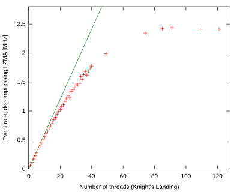
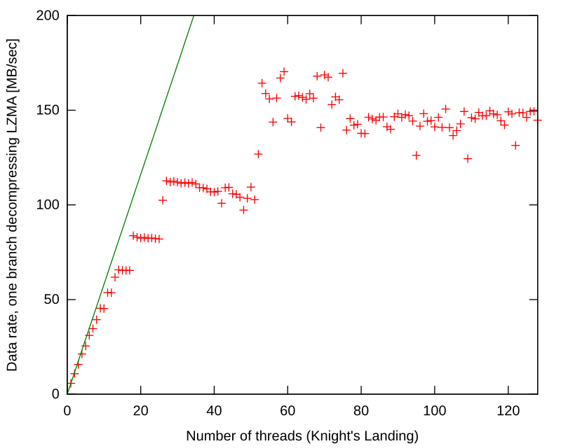

# uproot

uproot (or &mu;proot, for "micro-Python ROOT") is a demonstration of how little is needed to read data from a ROOT file. Only about a thousand lines of Python code can convert ROOT TTrees into Numpy arrays.

It is important to note that uproot is _not_ maintained by the [ROOT project team](https://root.cern/) and it is _not_ a fully featured ROOT replacement. Think of it as a file format library, analogous to h5py, parquet-python, or PyFITS. It just reads (and someday writes) files.

_Post bug reports in the [issues tab here](https://github.com/scikit-hep/uproot/issues), not on the ROOT forum!_

## Installation

uproot requires only Python and Numpy. Install it with

```bash
pip install uproot --user
```

The other packages listed below are merely recommended (and may be installed at any time in the future), as they unlock special features:

   * **Python 2.6, 2.7 or 3.4+** _(required)_
   * **Numpy 1.4+** _(required)_
   * **python-lzma** ([pip](https://pypi.python.org/pypi/backports.lzma), [conda](https://anaconda.org/conda-forge/backports.lzma)) if you want to read ROOT files compressed with lzma and you're using Python 2 (lzma is part of Python 3's standard library)
   * **python-lz4** ([pip](https://pypi.python.org/pypi/lz4), [conda](https://anaconda.org/anaconda/lz4)) if you want to read ROOT files compressed with lz4
   * **python-futures** ([pip](https://pypi.python.org/pypi/futures), [conda](https://anaconda.org/anaconda/futures)) if you want to read and/or decompress basket data in parallel and you're using Python 2 (futures is part of Python 3's standard library)
   * **pyxrootd** (no pip, [conda](https://anaconda.org/search?q=xrootd), [source](http://xrootd.org/dload.html)) if you want to access files with XRootD (`root://`) protocol. (Hint: if you install from source, you may have to set `PYTHONPATH` and `LD_LIBRARY_PATH`.)

_You do not need C++ ROOT to run uproot._

## Examples

Load a tree from a file:

```python
>>> import uproot
>>> tree = uproot.open("tests/Zmumu.root")["events"]
>>> tree
<TTree 'events' len=2304 at 0x73c8a1191450>
```

Note that this one-liner would segfault in PyROOT because of a mismatch between ROOT's memory management and Python's. In uproot, there's only one memory manager: Python.

```python
>>> import ROOT
>>> tree = ROOT.TFile("tests/Zmumu.root").Get("events")
>>> tree
```

Next, get all the data as arrays (if you have enough memory):

```python
>>> for branchname, array in tree.arrays().items():
...     print("{}\t{}".format(branchname, array))
...
b'Q2'    [-1  1  1 ..., -1 -1 -1]
b'pz1'   [-68.96496181 -48.77524654 -48.77524654 ..., -74.53243061 -74.53243061
          -74.80837247]
b'Q1'    [ 1 -1 -1 ...,  1  1  1]
b'py1'   [ 17.4332439  -16.57036233 -16.57036233 ...,   1.19940578   1.19940578
            1.2013503 ]
b'E2'    [  60.62187459   82.20186639   81.58277833 ...,  168.78012134  170.58313243
           170.58313243]
b'Run'   [148031 148031 148031 ..., 148029 148029 148029]
b'eta2'  [-1.05139 -1.21769 -1.21769 ..., -1.4827  -1.4827  -1.4827 ]
b'Type'  [ 2 71 84 ...,  2 71 71]
b'pt2'   [ 38.8311  44.7322  44.7322 ...,  72.8781  72.8781  72.8781]
b'E1'    [ 82.20186639  62.34492895  62.34492895 ...,  81.27013558  81.27013558
           81.56621735]
b'pz2'   [ -47.42698439  -68.96496181  -68.44725519 ..., -152.2350181  -153.84760383
          -153.84760383]
b'pt1'   [ 44.7322  38.8311  38.8311 ...,  32.3997  32.3997  32.3997]
b'M'     [ 82.46269156  83.62620401  83.30846467 ...,  95.96547966  96.49594381
           96.65672765]
b'phi2'  [-0.440873  2.74126   2.74126  ..., -2.77524  -2.77524  -2.77524 ]
b'px1'   [-41.19528764  35.11804977  35.11804977 ...,  32.37749196  32.37749196
           32.48539387]
b'px2'   [ 34.14443725 -41.19528764 -40.88332344 ..., -68.04191497 -68.79413604
          -68.79413604]
b'Event' [10507008 10507008 10507008 ..., 99991333 99991333 99991333]
b'py2'   [-16.11952457  17.4332439   17.29929704 ..., -26.10584737 -26.39840043
          -26.39840043]
b'eta1'  [-1.21769 -1.05139 -1.05139 ..., -1.57044 -1.57044 -1.57044]
b'phi1'  [ 2.74126   -0.440873  -0.440873  ...,  0.0370275  0.0370275  0.0370275]
```

Or just get one or a few arrays:

```python
>>> tree.array("M")
array([ 82.46269156,  83.62620401,  83.30846467, ...,  95.96547966,
        96.49594381,  96.65672765])
>>> 
>>> tree.arrays(["px1", "py1", "pz1"])
{'px1': array([-41.19528764,  35.11804977,  35.11804977, ...,  32.37749196,
                32.37749196,  32.48539387]),
 'py1': array([ 17.4332439 , -16.57036233, -16.57036233, ...,   1.19940578,
                 1.19940578,   1.2013503 ]),
 'pz1': array([-68.96496181, -48.77524654, -48.77524654, ..., -74.53243061,
               -74.53243061, -74.80837247])}
```

Or iterate over arrays with a fixed number of entries each:

```python
>>> import numpy
>>> for px1, py1 in tree.iterator(2000, ["px1", "py1"], outputtype=tuple):
...     print(numpy.sqrt(px1**2 + py1**2))
... 
[ 44.7322  38.8311  38.8311 ...,  73.6439  73.6052  33.716  ]
[ 45.9761  45.9761  45.8338 ...,  32.3997  32.3997  32.5076 ]
  ...
```

(Strings and other variable-length data are handled appropriately.)

## More examples

[&gt;&gt;&gt; Find more examples on GitHub Gists! &lt;&lt;&lt;](https://gist.github.com/search?utf8=%E2%9C%93&q=%22import+uproot%22+OR+%22from+uproot%22&ref=searchresults)

## Performance

Normally, you'd think that a library written in Python would be slow. If you're loading gigabytes from a ROOT file, however, most of the time is spent in operating system calls, decompression routines, or Numpy. These external calls do not suffer from the dynamic checks that are performed between each Python byte-instruction and are therefore as fast as compiled code.

So uproot doesn't pay a performance penalty for being written in Python. As it turns out, it's also faster than C++ ROOT because it does much less work.

[Jakob Blomer's ACAT 2017 talk](https://indico.cern.ch/event/567550/contributions/2628878/) evaluates ROOT performance for analysis (and other formats); I repeated his procedure with [the same data](https://cernbox.cern.ch/index.php/s/ub43DwvQIFwxfxs) on an otherwise idle physical machine (`techlab-gpu-nvidiak20-04.cern.ch`). This is the uncompressed file (`B2HHH.root`), read with a warmed virtual memory cache to emphasize time spent by the library rather than disk-reading or decompression.

The first comparison is time spent opening the file and loading the TTree. This is relevant if you are executing a procedure on a large set of files (TChain). uproot is about 16 times faster.

|          | Time to open file |
|---------:|:-----------------:|
| C++ ROOT | 0.50 sec          |
| uproot   | 0.03 sec          |

Next is the time to read nearly all branches, exactly the same as [the test](https://github.com/jblomer/iotools/blob/acat17/precision_test.cc) on page 11 of Jakob's talk. uproot is about 5 times faster.

|          | Time to read file | Event rate | Data rate    |
|---------:|:-----------------:|:----------:|:------------:|
| C++ ROOT | 4.62 sec          | 1.9 MHz    |  230 MB/sec  |
| uproot   | 0.93 sec          | 9.2 MHz    | 1160 MB/sec  |

Finally, we load only one branch (replacing `TTree::GetEntry` with `TBranch::GetEntry` in C++ ROOT to avoid a performance penalty). uproot is about 4 times faster.

|          | Time to read 1 branch | Event rate | Data rate    |
|---------:|:---------------------:|:----------:|:------------:|
| C++ ROOT | 0.256 sec             |  33 MHz    |  260 MB/sec  |
| uproot   | 0.064 sec             | 133 MHz    | 1020 MB/sec  |

<!--

; entries          = 8556118
; whole file bytes = 1129407576
; 1 branch bytes   = 68448944

;;;;;; 18 branches, as in Jakob's procedure

; C++ ROOT
(/ (+ 0.517089 0.513953 0.517802 0.505469 0.561045) 5.0)
0.5230716
(/ (+ 4.5475 4.78242 4.56754 4.50491 4.71264) 5.0)
4.6230020000000005
(* (/ 8556118 4.6230020000000005) 1e-6)
1.8507709925282312
(/ 1129407576 4.6230020000000005 1024 1024)
232.9843244683519

; uproot
(/ (+ 0.022559165954589844 0.021847963333129883 0.021809101104736328 0.02143692970275879 0.02207207679748535) 5.0)
0.02194504737854004
(/ (+ 0.9406819343566895 0.9218568801879883 0.9291090965270996 0.9257869720458984 0.9282817840576172) 5.0)
0.9291433334350586
(* (/ 8556118 0.9291433334350586) 1e-6)
9.208609363173156
(/ 1129407576 0.9291433334350586 1024 1024)
1159.2258796108788

;;;;;; single branch

; C++ ROOT

(/ (+ 0.521247 0.49853 0.499854 0.505716 0.499476) 5.0)
0.5049646
(/ (+ 0.233674 0.270155 0.260323 0.255569 0.259329) 5.0)
0.25581
(* (/ 8556118 0.25581) 1e-6)
33.44716000156366
(/ 68448944 0.25581 1024 1024)
255.18157960177356

; uproot

(/ (+ 0.021924972534179688 0.024873971939086914 0.021758079528808594 0.021612882614135742 0.03248000144958496) 5.0)
0.02452998161315918
(/ (+ 0.0639491081237793 0.06409692764282227 0.06480598449707031 0.06393790245056152 0.06397199630737305) 5.0)
0.06415238380432128
(* (/ 8556118 0.06415238380432128) 1e-6)
133.3717859354692
(/ 68448944 0.06415238380432128 1024 1024)
1017.5459742391145

-->

All of the above tests are single-threaded, and you'd be right to wonder if uproot scales poorly because of Python's Global Interpreter Lock (GIL). However, most external calls release the GIL, allowing parallel threads to be effective.

The tests below were performed on a Knight's Landing processor, which has hundreds of physical cores. The left is the whole file test and the right is the single branch test, which shows some interesting structure that gets smoothed over when all branches use the same thread pool. Threads were pinned to cores, and this file is compressed with lzma, which requires the most CPU time to decompress (to emphasize parallel processing).

C++ ROOT is not on this plot because decompressing baskets in parallel is [an upcoming feature](https://github.com/root-project/root/pull/785).

 

uproot scales to about 30 threads, which is more cores than many machines have. After that, split your job into multiple processes (Python's `multiprocessing` module).

## What works and what doesn't

| ROOT type | Numpy type | Status |
|:----------|:-----------|:------:|
| single-leaf numeric branches (boolean, signed/unsigned integers, floating point) | corresponding Numpy arrays with big-endian `dtype`; if native endian arrays are important to you (e.g. for Numba), cast on the fly by passing an explicit `dtype` | done |
| single-leaf string branches like `TLeafC` or `TString` | Numpy object array of Python strings (`bytes` objects); if performance is important and you can handle a `uint8` array of raw bytes, pass `uint8` as the `dtype` | done |
| multi-leaf branches (a.k.a. "leaflist") | Numpy record-arrays | **TODO!** |
| fixed-length array of items per entry, declared as `myleaf[10]` | Numpy array with a multidimensional `shape` | done |
| variable-length array of items per entry, declared as `myleaf[N]` | Numpy array with no boundaries between entries; use the corresponding counter (`N` in this example) to distinguish events | done |
| fully-split C++ class objects, stored in the TTree as one branch per class member | one array per class member, following the rules above | done |
| `TClonesArray` of several fully-split C++ class objects per entry | same as above; use counters (e.g. a leaf named `nMuons`) to determine how many objects per event | done |
| _unsplit_ class objects | much too complicated and not useful to view as Numpy; always save your ROOT files with maximum split level | will not do |
| `std::vector` and `std::string` | complicated encoding, would be slow to navigate in Python, yet frequently used in analysis | worthwhile? |

If you need to work with split objects or variable-length arrays and don't want to deal with the flattened array format and counters, [consider using PLUR](https://github.com/diana-hep/plur), which allows you to write code as though they were Python objects.

## Planned features

   * the **TODO** items in the above table;
   * reading a few basic types of non-TTree objects, relelvant for analysis, such as histograms and graphs;
   * writing TTrees: flat, no structure, and no reading and writing to the same file;
   * import-on-demand connections to Pandas, Keras, TensorFlow, PySpark, etc.

## Acknowledgements

Conversations with Philippe Canal were essential for understanding ROOT I/O. Working with Brian Bockelman on his BulkIO additions to C++ ROOT helped to clarify the distinction between what is I/O and what is user interface. Finally, Sebastien Binet's [go-hep](https://github.com/go-hep/hep) provided a clean implementation to ~~pillage~~ imitate, resolving many questions about byte-by-byte interpretations and serialized class versions.
