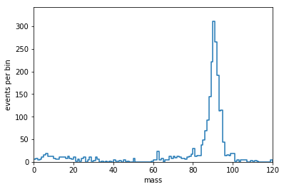
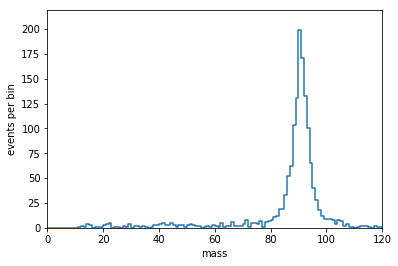

This is a deprecated version of Uproot
======================================

See `scikit-hep/uproot4 <https://github.com/scikit-hep/uproot4>`__ for the latest version of Uproot. Old and new versions are available as separate packages,

.. code-block:: bash

    pip install uproot    # old
    pip install uproot4   # new

because the interface has changed. Later this year, "Uproot 4" will simply become the `uproot` package with version number 4.0. Then the two packages will shift to

.. code-block:: bash

    pip install uproot    # new
    pip install uproot3   # old

You can adopt the new library gradually by importing both in Python, switching to the old version as a contingency (missing feature or bug in the new version). Note that Uproot 3 returns old-style `Awkward 0 <https://github.com/scikit-hep/awkward-array#readme>`__ arrays and Uproot 4 returns new-style `Awkward 1 <https://github.com/scikit-hep/awkward-1.0#readme>`__ arrays. (The new version of Uproot was motivated by the new version of Awkward, to make a clear distinction.)

uproot
======

.. image:: https://travis-ci.org/scikit-hep/uproot.svg?branch=master
   :target: https://travis-ci.org/scikit-hep/uproot

.. image:: https://readthedocs.org/projects/uproot/badge/?version=latest
   :target: https://uproot.readthedocs.io/en/latest/?badge=latest

.. image:: https://zenodo.org/badge/DOI/10.5281/zenodo.1173083.svg
   :target: https://doi.org/10.5281/zenodo.1173083

.. image:: https://mybinder.org/badge_logo.svg
   :target: https://mybinder.org/v2/gh/scikit-hep/uproot/master?urlpath=lab/tree/binder%2Ftutorial.ipynb

|PyPI version|
|Conda-Forge|

.. |PyPI version| image:: https://badge.fury.io/py/uproot.svg
   :target: https://badge.fury.io/py/uproot

.. |Conda-Forge| image:: https://img.shields.io/conda/vn/conda-forge/uproot
   :target: https://github.com/conda-forge/uproot-feedstock

.. inclusion-marker-1-do-not-remove

ROOT I/O in pure Python and Numpy.

.. inclusion-marker-1-5-do-not-remove

uproot (originally μproot, for "micro-Python ROOT") is a reader and a writer of the `ROOT file format <https://root.cern/>`__ using only Python and Numpy. Unlike the standard C++ ROOT implementation, uproot is only an I/O library, primarily intended to stream data into machine learning libraries in Python. Unlike PyROOT and root_numpy, uproot does not depend on C++ ROOT. Instead, it uses Numpy to cast blocks of data from the ROOT file as Numpy arrays.

Python does not necessarily mean slow. As long as the data blocks ("baskets") are large, this "array at a time" approach can even be faster than "event at a time" C++. Below, the rate of reading data into arrays with uproot is shown to be faster than C++ ROOT (left) and root_numpy (right), as long as the baskets are tens of kilobytes or larger (for a variable number of muons per event in an ensemble of different physics samples; higher is better).

.. inclusion-marker-replaceplots-start

.. raw:: html

    <table border="0"><tr><td></td><td></td></tr></table>

.. inclusion-marker-replaceplots-stop

uproot is not maintained by the ROOT project team, so post bug reports here as `GitHub issues <https://github.com/scikit-hep/uproot/issues>`__, not on a ROOT forum. Thanks!

.. inclusion-marker-2-do-not-remove

Installation
============

Install uproot like any other Python package:

.. code-block:: bash

    pip install uproot                       # maybe with sudo or --user, or in virtualenv

or install with `conda <https://conda.io/en/latest/miniconda.html>`__:

.. code-block:: bash

    conda config --add channels conda-forge  # if you haven't added conda-forge already
    conda install uproot

The pip installer automatically installs strict dependencies; the conda installer also installs optional dependencies (except for Pandas).

Strict dependencies:
--------------------

- `numpy <https://scipy.org/install.html>`__ (1.13.1+)
- `awkward-array <https://github.com/scikit-hep/awkward-array>`__ (0.12.0+)
- `uproot-methods <https://github.com/scikit-hep/uproot-methods>`__ (0.7.0+)
- `cachetools <https://pypi.org/project/cachetools>`__

Optional dependencies:
----------------------

- `lz4 <https://pypi.org/project/lz4>`__ to read/write lz4-compressed ROOT files
- `xxhash <https://pypi.org/project/xxhash/>`__ to read/write lz4-compressed ROOT files
- `lzma <https://pypi.org/project/backports.lzma>`__ to read/write lzma-compressed ROOT files in Python 2
- `xrootd <https://anaconda.org/conda-forge/xrootd>`__ to access remote files through XRootD
- `requests <https://pypi.org/project/requests>`__ to access remote files through HTTP
- `pandas <https://pandas.pydata.org>`__ to fill Pandas DataFrames instead of Numpy arrays

**Reminder: you do not need C++ ROOT to run uproot.**

Testing and development requirements
------------------------------------

The packages need to run the test suite can be installed via ``pip install
"uproot[testing]"``. Here is an example how to set up a development

.. code-block:: bash

    git clone https://github.com/scikit-hep/uproot.git  # alternatively your own fork
    cd uproot
    python -m venv venv  # create a virtual environment in the folder venv
    . venv/bin/activate  # activate the Python environment
    pip install -e ".[testing]"   # installs uproot in editable mode with all packages required for testing
    pytest               # run the test suite

.. inclusion-marker-3-do-not-remove

Questions
=========

If you have a question about how to use uproot that is not answered in the document below, I recommend asking your question on `StackOverflow <https://stackoverflow.com/questions/tagged/uproot>`__ with the ``[uproot]`` tag. (I get notified of questions with this tag.)

.. raw:: html

   

If you believe you have found a bug in uproot, post it on the `GitHub issues tab <https://github.com/scikit-hep/uproot/issues>`__.

Tutorial
========

Run `this tutorial <https://mybinder.org/v2/gh/scikit-hep/uproot/master?urlpath=lab/tree/binder%2Ftutorial.ipynb>`__ on Binder.

**Tutorial contents:**

* `Introduction <#introduction>`__
* `What is uproot? <#what-is-uproot>`__
* `Exploring a file <#exploring-a-file>`__

  - `Compressed objects in ROOT files <#compressed-objects-in-root-files>`__
  - `Exploring a TTree <#exploring-a-ttree>`__
  - `Some terminology <#some-terminology>`__

* `Reading arrays from a TTree <#reading-arrays-from-a-ttree>`__
* `Caching data <#caching-data>`__

  - `Automatically managed caches <#automatically-managed-caches>`__
  - `Caching at all levels of abstraction <#caching-at-all-levels-of-abstraction>`__

* `Lazy arrays <#lazy-arrays>`__

  - `Lazy array of many files <#lazy-array-of-many-files>`__
  - `Lazy arrays with caching <#lazy-arrays-with-caching>`__
  - `Lazy arrays as lightweight skims <#lazy-arrays-as-lightweight-skims>`__
  - `Lazy arrays in Dask <#lazy-arrays-in-dask>`__

* `Iteration <#iteration>`__

  - `Filenames and entry numbers while iterating <#filenames-and-entry-numbers-while-iterating>`__
  - `Limiting the number of entries to be read <#limiting-the-number-of-entries-to-be-read>`__
  - `Controlling lazy chunk and iteration step sizes <#controlling-lazy-chunk-and-iteration-step-sizes>`__
  - `Caching and iteration <#caching-and-iteration>`__

* `Changing the output container type <#changing-the-output-container-type>`__
* `Filling Pandas DataFrames <#filling-pandas-dataframes>`__
* `Selecting and interpreting branches <#selecting-and-interpreting-branches>`__

  - `TBranch interpretations <#tbranch-interpretations>`__
  - `Reading data into a preexisting array <#reading-data-into-a-preexisting-array>`__
  - `Passing many new interpretations in one call <#passing-many-new-interpretations-in-one-call>`__
  - `Multiple values per event: fixed size arrays <#multiple-values-per-event-fixed-size-arrays>`__
  - `Multiple values per event: leaf-lists <#multiple-values-per-event-leaf-lists>`__
  - `Multiple values per event: jagged arrays <#multiple-values-per-event-jagged-arrays>`__
  - `Jagged array performance <#jagged-array-performance>`__
  - `Special physics objects: Lorentz vectors <#special-physics-objects-lorentz-vectors>`__
  - `Variable-width values: strings <#variable-width-values-strings>`__
  - `Arbitrary objects in TTrees <#arbitrary-objects-in-ttrees>`__
  - `Doubly nested jagged arrays (i.e. std::vector<std::vector<T>>) <#doubly-nested-jagged-arrays-ie-stdvectorstdvectort>`__

* `Parallel array reading <#parallel-array-reading>`__
* `Histograms, TProfiles, TGraphs, and others <#histograms-tprofiles-tgraphs-and-others>`__
* `Creating and writing data to ROOT files <#creating-and-writing-data-to-root-files>`__

  - `Writing histograms <#writing-histograms>`__
  - `Writing TTrees <#writing-ttrees>`__

Reference documentation
=======================

For a list of all functions, classes, methods, and their parameters, click below.

* `Opening files <http://uproot.readthedocs.io/en/latest/opening-files.html>`__

  - `uproot.open <http://uproot.readthedocs.io/en/latest/opening-files.html#uproot-open>`__
  - `uproot.xrootd <http://uproot.readthedocs.io/en/latest/opening-files.html#uproot-xrootd>`__
  - `uproot.http <http://uproot.readthedocs.io/en/latest/opening-files.html#uproot-http>`__
  - `uproot.iterate <http://uproot.readthedocs.io/en/latest/opening-files.html#uproot-iterate>`__
  - `uproot.pandas.iterate <http://uproot.readthedocs.io/en/latest/opening-files.html#uproot-pandas-iterate>`__
  - `uproot.lazyarray(s) <http://uproot.readthedocs.io/en/latest/opening-files.html#uproot-lazyarray-and-lazyarrays>`__
  - `uproot.daskarray/daskframe <http://uproot.readthedocs.io/en/latest/opening-files.html#uproot-daskarray-and-daskframe>`__
  - `uproot.numentries <http://uproot.readthedocs.io/en/latest/opening-files.html#uproot-numentries>`__

* `ROOT I/O <http://uproot.readthedocs.io/en/latest/root-io.html>`__

  - `uproot.rootio.ROOTDirectory <http://uproot.readthedocs.io/en/latest/root-io.html#uproot-rootio-rootdirectory>`__
  - `uproot.rootio.ROOTObject <http://uproot.readthedocs.io/en/latest/root-io.html#uproot-rootio-rootobject>`__
  - `uproot.rootio.ROOTStreamedObject <http://uproot.readthedocs.io/en/latest/root-io.html#uproot-rootio-rootstreamedobject>`__

* `TTree Handling <http://uproot.readthedocs.io/en/latest/ttree-handling.html>`__

  - `uproot.tree.TTreeMethods <http://uproot.readthedocs.io/en/latest/ttree-handling.html#uproot-tree-ttreemethods>`__
  - `uproot.tree.TBranchMethods <http://uproot.readthedocs.io/en/latest/ttree-handling.html#uproot-tree-tbranchmethods>`__

* `Interpretation <http://uproot.readthedocs.io/en/latest/interpretation.html>`__
* `Caches <http://uproot.readthedocs.io/en/latest/caches.html>`__
* `Parallel I/O <http://uproot.readthedocs.io/en/latest/parallel-io.html>`__

Introduction
============

This tutorial is designed to help you start using uproot. Unlike the
`reference documentation <https://uproot.readthedocs.io/en/latest/>`__,
which defines every parameter of every function, this tutorial provides
introductory examples to help you learn how to use them.

The original tutorial `has been
archived <https://github.com/scikit-hep/uproot/blob/master/docs/old-tutorial.rst>`__—this
version was written in June 2019 in response to feedback from a series
of tutorials I presented early this year and common questions in the
`GitHub issues <https://github.com/scikit-hep/uproot/issues>`__. The new
tutorial is `executable on
Binder <https://mybinder.org/v2/gh/scikit-hep/uproot/master?urlpath=lab/tree/binder%2Ftutorial.ipynb>`__
and may be read in any order, though it has to be executed from top to
bottom because some variables are reused.

What is uproot?
===============

Uproot is a Python package; it is pip and conda-installable, and it only
depends on other Python packages. Although it is similar in function to
`root_numpy <https://pypi.org/project/root-numpy/>`__ and
`root_pandas <https://pypi.org/project/root_pandas/>`__, it does not
compile into ROOT and therefore avoids issues in which the version used
in compilation differs from the version encountered at runtime.

In short, you should never see a segmentation fault.

.. raw:: html

   

Uproot is strictly concerned with file I/O only—all other functionality
is handled by other libraries:

-  `uproot-methods <https://github.com/scikit-hep/uproot-methods>`__:
   physics methods for types read from ROOT files, such as histograms
   and Lorentz vectors. It is intended to be largely user-contributed
   (and is).
-  `awkward-array <https://github.com/scikit-hep/awkward-array>`__:
   array manipulation beyond
   `Numpy <https://docs.scipy.org/doc/numpy/reference/>`__. Several are
   encountered in this tutorial, particularly lazy arrays and jagged
   arrays.

In the past year, uproot has become one of the most widely used Python
packages made for particle physics, with users in all four LHC experiments,
theory, neutrino experiments, XENON-nT (dark matter direct detection),
MAGIC (gamma ray astronomy), and IceCube (neutrino astronomy).

.. raw:: html

   

Exploring a file
================

`uproot.open <https://uproot.readthedocs.io/en/latest/opening-files.html#uproot-open>`__
is the entry point for reading a single file.

It takes a local filename path or a remote ``http://`` or ``root://``
URL. (HTTP requires the Python
`requests <https://pypi.org/project/requests/>`__ library and XRootD
requires `pyxrootd <http://xrootd.org/>`__, both of which have to be
explicitly pip-installed if you installed uproot with pip, but are
automatically installed if you installed uproot with conda.)

.. code-block:: python3

    import uproot

    file = uproot.open("http://scikit-hep.org/uproot/examples/nesteddirs.root")
    file
    # <ROOTDirectory b'tests/nesteddirs.root' at 0x7f37504ecc50>

`uproot.open <https://uproot.readthedocs.io/en/latest/opening-files.html#uproot-open>`__
returns a
`ROOTDirectory <https://uproot.readthedocs.io/en/latest/root-io.html#uproot-rootio-rootdirectory>`__,
which behaves like a Python dict; it has ``keys()``, ``values()``, and
key-value access with square brackets.

.. code-block:: python3

    file.keys()
    # [b'one;1', b'three;1']

    file["one"]
    # <ROOTDirectory b'one' at 0x7f3750588710>

Subdirectories also have type
`ROOTDirectory <https://uproot.readthedocs.io/en/latest/root-io.html#uproot-rootio-rootdirectory>`__,
so they behave like Python dicts, too.

.. code-block:: python3

    file["one"].keys()
    # [b'two;1', b'tree;1']

    file["one"].values()
    # [<ROOTDirectory b'two' at 0x7f3750588fd0>, <TTree b'tree' at 0x7f3750588cc0>]

**What’s the `b` before each object name?** Python 3 distinguishes
between bytestrings and encoded strings. ROOT object names have no
encoding, such as Latin-1 or Unicode, so uproot presents them as raw
bytestrings. However, if you enter a Python string (no ``b``) and it
matches an object name (interpreted as plain ASCII), it will count as a
match, as ``"one"`` does above.

**What’s the `;1` after each object name?** ROOT objects are versioned
with a “cycle number.” If multiple objects are written to the ROOT file
with the same name, they will have different cycle numbers, with the
largest value being last. If you don’t specify a cycle number, you’ll
get the latest one.

This file is deeply nested, so while you could find the TTree with

.. code-block:: python3

    file["one"]["two"]["tree"]
    # <TTree b'tree' at 0x7f37581297f0>

you can also find it using a directory path, with slashes.

.. code-block:: python3

    file["one/two/tree"]
    # <TTree b'tree' at 0x7f37504e4748>

Here are a few more tricks for finding your way around a file:

-  the ``keys()``, ``values()``, and ``items()`` methods have
   ``allkeys()``, ``allvalues()``, ``allitems()`` variants that
   recursively search through all subdirectories;
-  all of these functions can be filtered by name or class: see
   `ROOTDirectory.keys <https://uproot.readthedocs.io/en/latest/root-io.html#uproot.rootio.ROOTDirectory.keys>`__.

Here’s how you would search the subdirectories to find all TTrees:

.. code-block:: python3

    file.allkeys(filterclass=lambda cls: issubclass(cls, uproot.tree.TTreeMethods))
    # [b'one/two/tree;1', b'one/tree;1', b'three/tree;1']

Or get a Python dict of them:

.. code-block:: python3

    all_ttrees = dict(file.allitems(filterclass=lambda cls: issubclass(cls, uproot.tree.TTreeMethods)))
    all_ttrees
    # {b'one/two/tree;1': <TTree b'tree' at 0x7f37504f85f8>,
    #  b'one/tree;1': <TTree b'tree' at 0x7f37504f8710>,
    #  b'three/tree;1': <TTree b'tree' at 0x7f37504f8470>}

Be careful: Python 3 is not as forgiving about matching key names.
``all_ttrees`` is a plain Python dict, so the key must be a bytestring
and must include the cycle number.

.. code-block:: python3

    all_ttrees[b"one/two/tree;1"]
    # <TTree b'tree' at 0x7f37504f85f8>

Compressed objects in ROOT files
--------------------------------

Objects in ROOT files can be uncompressed, compressed with ZLIB,
compressed with LZMA, or compressed with LZ4. Uproot picks the right
decompressor and gives you the objects transparently: you don’t have to
specify anything. However, if an object is compressed with LZ4 and you
don’t have the `lz4 <https://pypi.org/project/lz4/>`__ library
installed, you’ll get an error with installation instructions in the
message. (It is automatically installed if you installed uproot with
conda.) ZLIB is part of the Python Standard Library, and LZMA is part of
the Python 3 Standard Library, so you won’t get error messages about
these except for LZMA in Python 2 (for which there is
`backports.lzma <https://pypi.org/project/backports.lzma/>`__,
automatically installed if you installed uproot with conda).

The
`ROOTDirectory <https://uproot.readthedocs.io/en/latest/root-io.html#uproot-rootio-rootdirectory>`__
class has a ``compression`` property that tells you the compression
algorithm and level associated with this file,

.. code-block:: python3

    file.compression
    # <Compression 'zlib' 1>

but any object can be compressed with any algorithm at any level—this is
only the default compression for the file. Some ROOT files are written
with each TTree branch compressed using a different algorithm and level.

Exploring a TTree
-----------------

TTrees are special objects in ROOT files: they contain most of the
physics data. Uproot presents TTrees as subclasses of
`TTreeMethods <https://uproot.readthedocs.io/en/latest/ttree-handling.html#uproot-tree-ttreemethods>`__.

(**Why subclass?** Different ROOT files can have different versions of a
class, so uproot generates Python classes to fit the data, as needed.
All TTrees inherit from
`TTreeMethods <https://uproot.readthedocs.io/en/latest/ttree-handling.html#uproot-tree-ttreemethods>`__
so that they get the same data-reading methods.)

.. code-block:: python3

    events = uproot.open("http://scikit-hep.org/uproot/examples/Zmumu.root")["events"]
    events
    # <TTree b'events' at 0x7f375051fc18>

Although
`TTreeMethods <https://uproot.readthedocs.io/en/latest/ttree-handling.html#uproot-tree-ttreemethods>`__
objects behave like Python dicts of
`TBranchMethods <https://uproot.readthedocs.io/en/latest/ttree-handling.html#uproot-tree-tbranchmethods>`__
objects, the easiest way to browse a TTree is by calling its ``show()``
method, which prints the branches and their interpretations as arrays.

.. code-block:: python3

    events.keys()
    # [b'Type', b'Run', b'Event', b'E1', b'px1', b'py1', b'pz1', b'pt1', b'eta1', b'phi1', b'Q1',
    #  b'E2', b'px2', b'py2', b'pz2', b'pt2', b'eta2', b'phi2', b'Q2', b'M']

.. code-block:: python3

    events.show()
    # Type                       (no streamer)              asstring()
    # Run                        (no streamer)              asdtype('>i4')
    # Event                      (no streamer)              asdtype('>i4')
    # E1                         (no streamer)              asdtype('>f8')
    # px1                        (no streamer)              asdtype('>f8')
    # py1                        (no streamer)              asdtype('>f8')
    # pz1                        (no streamer)              asdtype('>f8')
    # pt1                        (no streamer)              asdtype('>f8')
    # eta1                       (no streamer)              asdtype('>f8')
    # phi1                       (no streamer)              asdtype('>f8')
    # Q1                         (no streamer)              asdtype('>i4')
    # E2                         (no streamer)              asdtype('>f8')
    # px2                        (no streamer)              asdtype('>f8')
    # py2                        (no streamer)              asdtype('>f8')
    # pz2                        (no streamer)              asdtype('>f8')
    # pt2                        (no streamer)              asdtype('>f8')
    # eta2                       (no streamer)              asdtype('>f8')
    # phi2                       (no streamer)              asdtype('>f8')
    # Q2                         (no streamer)              asdtype('>i4')
    # M                          (no streamer)              asdtype('>f8')

Basic information about the TTree, such as its number of entries, are
available as properties.

.. code-block:: python3

    events.name, events.title, events.numentries
    # (b'events', b'Z -> mumu events', 2304)

Some terminology
----------------

ROOT files contain objects internally referred to via ``TKeys``
(dict-like lookup in uproot). ``TTree`` organizes data in ``TBranches``,
and uproot interprets one ``TBranch`` as one array, either a `Numpy
array <https://docs.scipy.org/doc/numpy/reference/generated/numpy.array.html>`__
or an `awkward array <https://github.com/scikit-hep/awkward-array>`__.
``TBranch`` data are stored in chunks called ``TBaskets``, though uproot
hides this level of granularity unless you dig into the details.

.. raw:: html

   

Reading arrays from a TTree
===========================

The bulk data in a TTree are not read until requested. There are many
ways to do that:

-  select a TBranch and call
   `TBranchMethods.array <https://uproot.readthedocs.io/en/latest/ttree-handling.html#id11>`__;
-  call
   `TTreeMethods.array <https://uproot.readthedocs.io/en/latest/ttree-handling.html#array>`__
   directly from the TTree object;
-  call
   `TTreeMethods.arrays <https://uproot.readthedocs.io/en/latest/ttree-handling.html#arrays>`__
   to get several arrays at a time;
-  call
   `TBranch.lazyarray <https://uproot.readthedocs.io/en/latest/ttree-handling.html#id13>`__,
   `TTreeMethods.lazyarray <https://uproot.readthedocs.io/en/latest/ttree-handling.html#lazyarray>`__,
   `TTreeMethods.lazyarrays <https://uproot.readthedocs.io/en/latest/ttree-handling.html#lazyarrays>`__,
   or
   `uproot.lazyarrays <https://uproot.readthedocs.io/en/latest/opening-files.html#uproot-lazyarray-and-lazyarrays>`__
   to get array-like objects that read on demand;
-  call
   `TTreeMethods.iterate <https://uproot.readthedocs.io/en/latest/ttree-handling.html#iterate>`__
   or
   `uproot.iterate <https://uproot.readthedocs.io/en/latest/opening-files.html#uproot-iterate>`__
   to explicitly iterate over chunks of data (to avoid reading more than
   would fit into memory);
-  call
   `TTreeMethods.pandas <https://uproot.readthedocs.io/en/latest/ttree-handling.html#id7>`__
   or
   `uproot.pandas.iterate <https://uproot.readthedocs.io/en/latest/opening-files.html#uproot-pandas-iterate>`__
   to get Pandas DataFrames (`Pandas <https://pandas.pydata.org/>`__
   must be installed).

Let’s start with the simplest.

.. code-block:: python3

    a = events.array("E1")
    a
    # array([82.20186639, 62.34492895, 62.34492895, ..., 81.27013558, 81.27013558, 81.56621735])

Since ``array`` is singular, you specify one branch name and get one
array back. This is a `Numpy
array <https://docs.scipy.org/doc/numpy/reference/generated/numpy.array.html>`__
of 8-byte floating point numbers, the `Numpy
dtype <https://docs.scipy.org/doc/numpy/reference/arrays.dtypes.html>`__
specified by the ``"E1"`` branch’s interpretation.

.. code-block:: python3

    events["E1"].interpretation
    # asdtype('>f8')

We can use this array in Numpy calculations; see the `Numpy
documentation <https://docs.scipy.org/doc/numpy/>`__ for details.

.. code-block:: python3

    import numpy

    numpy.log(a)
    # array([4.40917801, 4.13268234, 4.13268234, ..., 4.39777861, 4.39777861, 4.40141517])

Numpy arrays are also the standard container for entering data into
machine learning frameworks; see this `Keras
introduction <https://keras.io/>`__, `PyTorch
introduction <https://pytorch.org/tutorials/beginner/deep_learning_60min_blitz.html>`__,
`TensorFlow
introduction <https://www.tensorflow.org/guide/low_level_intro>`__, or
`Scikit-Learn
introduction <https://scikit-learn.org/stable/tutorial/basic/tutorial.html>`__
to see how to put Numpy arrays to work in machine learning.

The
`TBranchMethods.array <https://uproot.readthedocs.io/en/latest/ttree-handling.html#id11>`__
method is the same as
`TTreeMethods.array <https://uproot.readthedocs.io/en/latest/ttree-handling.html#array>`__
except that you don’t have to specify the TBranch name (naturally).
Sometimes one is more convenient, sometimes the other.

.. code-block:: python3

    events.array("E1"), events["E1"].array()
    # (array([82.20186639, 62.34492895, 62.34492895, ..., 81.27013558, 81.27013558, 81.56621735]),
    #  array([82.20186639, 62.34492895, 62.34492895, ..., 81.27013558, 81.27013558, 81.56621735]))

The plural ``arrays`` method is different. Whereas singular ``array``
could only return one array, plural ``arrays`` takes a list of names
(possibly including wildcards) and returns them all in a Python dict.

.. code-block:: python3

    events.arrays(["px1", "py1", "pz1"])
    # {b'px1': array([-41.1952876,  35.1180497,  35.1180497, ...,  32.3774919,  32.377492,  32.4853938]),
    #  b'py1': array([ 17.4332439, -16.5703623, -16.5703623, ...,   1.1994057,   1.199405,   1.2013503]),
    #  b'pz1': array([-68.9649618, -48.7752465, -48.7752465, ..., -74.5324306, -74.532430, -74.8083724])}

    events.arrays(["p[xyz]*"])
    # {b'px1': array([-41.1952876,  35.1180497,  35.1180497, ...,   32.377491,   32.37749,   32.485393]),
    #  b'py1': array([ 17.4332439, -16.5703623, -16.5703623, ...,    1.199405,    1.19940,    1.201350]),
    #  b'pz1': array([-68.9649618, -48.7752465, -48.7752465, ...,  -74.532430,  -74.53243,  -74.808372]),
    #  b'px2': array([ 34.1444372, -41.1952876, -40.8833234, ...,  -68.041914,  -68.79413,  -68.794136]),
    #  b'py2': array([-16.1195245,  17.4332439,  17.2992970, ...,  -26.105847,  -26.39840,  -26.398400]),
    #  b'pz2': array([ -47.426984, -68.9649618, -68.4472551, ..., -152.235018, -153.84760, -153.847603])}

As with all ROOT object names, the TBranch names are bytestrings
(prepended by ``b``). If you know the encoding or it doesn’t matter
(``"ascii"`` and ``"utf-8"`` are generic), pass a ``namedecode`` to get
keys that are strings.

.. code-block:: python3

    events.arrays(["p[xyz]*"], namedecode="utf-8")
    # {'px1': array([-41.1952876,  35.1180497,  35.11804977, ...,   32.377491,   32.377491,   32.485393]),
    #  'py1': array([ 17.4332439, -16.5703623, -16.57036233, ...,    1.199405,    1.199405,    1.201350]),
    #  'pz1': array([-68.9649618, -48.7752465, -48.77524654, ...,  -74.532430,  -74.532430,  -74.808372]),
    #  'px2': array([ 34.1444372, -41.1952876, -40.88332344, ...,  -68.041914,  -68.794136,  -68.794136]),
    #  'py2': array([-16.1195245,  17.4332439,  17.29929704, ...,  -26.105847,  -26.398400,  -26.398400]),
    #  'pz2': array([-47.4269843, -68.9649618, -68.44725519, ..., -152.235018, -153.847603, -153.847603])}

These array-reading functions have many parameters, but most of them
have the same names and meanings across all the functions. Rather than
discuss all of them here, they’ll be presented in context in sections on
special features below.

Caching data
============

Every time you ask for arrays, uproot goes to the file and re-reads
them. For especially large arrays, this can take a long time.

For quicker access, uproot’s array-reading functions have a **cache**
parameter, which is an entry point for you to manage your own cache. The
**cache** only needs to behave like a dict (many third-party Python
caches do).

.. code-block:: python3

    mycache = {}

    # first time: reads from file
    events.arrays(["p[xyz]*"], cache=mycache);

    # any other time: reads from cache
    events.arrays(["p[xyz]*"], cache=mycache);

In this example, the cache is a simple Python dict. Uproot has filled it
with unique ID → array pairs, and it uses the unique ID to identify an
array that it has previously read. You can see that it’s full by looking
at those keys:

.. code-block:: python3

    mycache
    # {'AAGUS3fQmKsR56dpAQAAf77v;events;px1;asdtype(Bf8(),Lf8());0-2304':
    #      array([-41.19528764,  35.11804977,  35.11804977, ...,  32.37749196, 32.37749196,  32.48539387]),
    #  'AAGUS3fQmKsR56dpAQAAf77v;events;py1;asdtype(Bf8(),Lf8());0-2304':
    #      array([ 17.4332439 , -16.57036233, -16.57036233, ...,   1.19940578, 1.19940578,   1.2013503 ]),
    #  'AAGUS3fQmKsR56dpAQAAf77v;events;pz1;asdtype(Bf8(),Lf8());0-2304':
    #      array([-68.96496181, -48.77524654, -48.77524654, ..., -74.53243061, -74.53243061, -74.80837247]),
    #  'AAGUS3fQmKsR56dpAQAAf77v;events;px2;asdtype(Bf8(),Lf8());0-2304':
    #      array([ 34.14443725, -41.19528764, -40.88332344, ..., -68.04191497, -68.79413604, -68.79413604]),
    #  'AAGUS3fQmKsR56dpAQAAf77v;events;py2;asdtype(Bf8(),Lf8());0-2304':
    #      array([-16.11952457,  17.4332439 ,  17.29929704, ..., -26.10584737, -26.39840043, -26.39840043]),
    #  'AAGUS3fQmKsR56dpAQAAf77v;events;pz2;asdtype(Bf8(),Lf8());0-2304':
    #      array([ -47.4269843,  -68.9649618,  -68.4472551, ..., -152.2350181, -153.8476038, -153.8476038])
    # }

though they’re not very human-readable.

If you’re running out of memory, you could manually clear your cache by
simply clearing the dict.

.. code-block:: python3

    mycache.clear()
    mycache
    # {}

Now the same line of code reads from the file again.

.. code-block:: python3

    # not in cache: reads from file
    events.arrays(["p[xyz]*"], cache=mycache)

Automatically managed caches
----------------------------

This manual process of clearing the cache when you run out of memory is
not very robust. What you want instead is a dict-like object that drops
elements on its own when memory is scarce.

Uproot has an
`ArrayCache <https://uproot.readthedocs.io/en/latest/caches.html#uproot-cache-arraycache>`__
class for this purpose, though it’s a thin wrapper around the
third-party `cachetools <https://pypi.org/project/cachetools/>`__
library. Whereas `cachetools <https://pypi.org/project/cachetools/>`__
drops old data from cache when a maximum number of items is reached,
`ArrayCache <https://uproot.readthedocs.io/en/latest/caches.html#uproot-cache-arraycache>`__
drops old data when the data usage reaches a limit, specified in bytes.

.. code-block:: python3

    mycache = uproot.ArrayCache("100 kB")
    events.arrays("*", cache=mycache);

    len(mycache), len(events.keys())
    # (6, 20)

With a limit of 100 kB, only 6 of the 20 arrays fit into cache, the rest
have been evicted.

All data sizes in uproot are specified as an integer in bytes (integers)
or a string with the appropriate unit (interpreted as powers of 1024,
not 1000).

The fact that any dict-like object may be a cache opens many
possibilities. If you’re struggling with a script that takes a long time
to load data, then crashes, you may want to try a process-independent
cache like
`memcached <https://realpython.com/python-memcache-efficient-caching/>`__.
If you have a small, fast disk, you may want to consider
`diskcache <http://www.grantjenks.com/docs/diskcache/tutorial.html>`__
to temporarily hold arrays from ROOT files on the big, slow disk.

Caching at all levels of abstraction
------------------------------------

All of the array-reading functions have a **cache** parameter to accept
a cache object. This is the high-level cache, which caches data after it
has been fully interpreted. These functions also have a **basketcache**
parameter to cache data after reading and decompressing baskets, but
before interpretation as high-level arrays. The main purpose of this is
to avoid reading TBaskets twice when an iteration step falls in the
middle of a basket (see below). There is also a **keycache** for caching
ROOT’s TKey objects, which use negligible memory but would be a
bottleneck to re-read when TBaskets are provided by a **basketcache**.

For more on these high and mid-level caching parameters, see `reference
documentation <https://uproot.readthedocs.io/en/latest/caches.html>`__.

At the lowest level of abstraction, raw bytes are cached by the HTTP and
XRootD remote file readers. You can control the memory remote file
memory use with ``uproot.HTTPSource.defaults["limitbytes"]`` and
``uproot.XRootDSource.defaults["limitbytes"]``, either by globally
setting these parameters before opening a file, or by passing them to
`uproot.open <https://uproot.readthedocs.io/en/latest/opening-files.html#uproot-open>`__
through the **limitbytes** parameter.

.. code-block:: python3

    # default remote file caches in MB
    uproot.HTTPSource.defaults["limitbytes"] / 1024**2, uproot.XRootDSource.defaults["limitbytes"] / 1024**2
    # (32.0, 32.0)

If you want to limit this cache to less than the default **chunkbytes**
of 1 MB, be sure to make the **chunkbytes** smaller, so that it’s
able to load at least one chunk!

.. code-block:: python3

    uproot.open("http://scikit-hep.org/uproot/examples/Zmumu.root", limitbytes="100 kB", chunkbytes="10 kB")
    # <ROOTDirectory b'Zmumu.root' at 0x7f375041f278>

By default (unless **localsource** is overridden), local files are
memory-mapped, so the operating system manages its byte-level cache.

Lazy arrays
===========

If you call
`TBranchMethods.array <https://uproot.readthedocs.io/en/latest/ttree-handling.html#id11>`__,
`TTreeMethods.array <https://uproot.readthedocs.io/en/latest/ttree-handling.html#array>`__,
or
`TTreeMethods.arrays <https://uproot.readthedocs.io/en/latest/ttree-handling.html#arrays>`__,
uproot reads the file or cache immediately and returns an in-memory
array. For exploratory work or to control memory usage, you might want
to let the data be read on demand.

The
`TBranch.lazyarray <https://uproot.readthedocs.io/en/latest/ttree-handling.html#id13>`__,
`TTreeMethods.lazyarray <https://uproot.readthedocs.io/en/latest/ttree-handling.html#lazyarray>`__,
`TTreeMethods.lazyarrays <https://uproot.readthedocs.io/en/latest/ttree-handling.html#lazyarrays>`__,
and
`uproot.lazyarrays <https://uproot.readthedocs.io/en/latest/opening-files.html#uproot-lazyarray-and-lazyarrays>`__
functions take most of the same parameters but return lazy array
objects, rather than Numpy arrays.

.. code-block:: python3

    data = events.lazyarrays("*")
    data
    # <ChunkedArray [<Row 0> <Row 1> <Row 2> ... <Row 2301> <Row 2302> <Row 2303>] at 0x7f375041fa20>

This ``ChunkedArray`` represents all the data in the file in chunks
specified by ROOT’s internal baskets (specifically, the places where the
baskets align, called “clusters”). Each chunk contains a
``VirtualArray``, which is read when any element from it is accessed.

.. code-block:: python3

    data = events.lazyarrays(entrysteps=500)   # chunks of 500 events each
    dataE1 = data["E1"]
    dataE1
    # <ChunkedArray [82.2018663875 62.3449289481 62.3449289481 ...
    #                81.2701355756 81.2701355756 81.5662173543] at 0x7f3750467400>

Requesting ``"E1"`` through all the chunks and printing it (above) has
caused the first and last chunks of the array to be read, because that’s
all that got written to the screen. (See the ``...``?)

.. code-block:: python3

    [chunk.ismaterialized for chunk in dataE1.chunks]
    # [True, False, False, False, True]

These arrays can be used with `Numpy’s universal
functions <https://docs.scipy.org/doc/numpy/reference/ufuncs.html>`__
(ufuncs), which are the mathematical functions that perform elementwise
mathematics.

.. code-block:: python3

    numpy.log(dataE1)
    # <ChunkedArray [4.409178007248409 4.132682336791151 4.132682336791151 4.104655794838432
    #                3.733527454020269 3.891440776178839 3.891440776178839 ...] at 0x7f37504560b8>

Now all of the chunks have been read, because the values were needed to
compute ``log(E1)`` for all ``E1``.

.. code-block:: python3

    [chunk.ismaterialized for chunk in dataE1.chunks]
    # [True, True, True, True, True]

(**Note:** only ufuncs recognize these lazy arrays because Numpy
provides a `mechanism to override
ufuncs <https://www.numpy.org/neps/nep-0013-ufunc-overrides.html>`__ but
a `similar mechanism for high-level
functions <https://www.numpy.org/neps/nep-0018-array-function-protocol.html>`__
is still in development. To turn lazy arrays into Numpy arrays, pass
them to the Numpy constructor, as shown below. This causes the whole
array to be loaded into memory and to be stitched together into a
contiguous whole.)

.. code-block:: python3

    numpy.array(dataE1)
    # array([82.20186639, 62.34492895, 62.34492895, ..., 81.27013558,
    #        81.27013558, 81.56621735])

Lazy array of many files
------------------------

There’s a lazy version of each of the array-reading functions in
`TTreeMethods <https://uproot.readthedocs.io/en/latest/ttree-handling.html#uproot-tree-ttreemethods>`__
and
`TBranchMethods <https://uproot.readthedocs.io/en/latest/ttree-handling.html#uproot-tree-tbranchmethods>`__,
but there’s also module-level
`uproot.lazyarray <https://uproot.readthedocs.io/en/latest/opening-files.html#uproot.tree.lazyarray>`__
and
`uproot.lazyarrays <https://uproot.readthedocs.io/en/latest/opening-files.html#uproot.tree.lazyarrays>`__.
These functions let you make a lazy array that spans many files.

These functions may be thought of as alternatives to ROOT’s TChain: a
TChain presents many files as though they were a single TTree, and a
file-spanning lazy array presents many files as though they were a
single array. See `Iteration <#iteration>`__ below as a more explicit TChain alternative.

.. code-block:: python3

    data = uproot.lazyarray(
        # list of files; local files can have wildcards (*)
        ["http://scikit-hep.org/uproot/examples/sample-%s-zlib.root" % x
            for x in ["5.23.02", "5.24.00", "5.25.02", "5.26.00", "5.27.02", "5.28.00",
                      "5.29.02", "5.30.00", "6.08.04", "6.10.05", "6.14.00"]],
        # TTree name in each file
        "sample",
        # branch(s) in each file for lazyarray(s)
        "f8")
    data
    # <ChunkedArray [-14.9 -13.9 -12.9 ... 12.1 13.1 14.1] at 0x7f3739bc37f0>

This ``data`` represents the entire set of files, and the only up-front
processing that had to be done was to find out how many entries each
TTree contains.

It uses the
`uproot.numentries <https://uproot.readthedocs.io/en/latest/opening-files.html#uproot-numentries>`__
shortcut method (which reads less data than normal file-opening):

.. code-block:: python3

    dict(uproot.numentries(
        # list of files; local files can have wildcards (*)
        ["http://scikit-hep.org/uproot/examples/sample-%s-zlib.root" % x
            for x in ["5.23.02", "5.24.00", "5.25.02", "5.26.00", "5.27.02", "5.28.00",
                      "5.29.02", "5.30.00", "6.08.04", "6.10.05", "6.14.00"]],
        # TTree name in each file
        "sample",
        # total=True adds all values; total=False leaves them as a dict
        total=False))

    # {'http://scikit-hep.org/uproot/examples/sample-5.23.02-zlib.root': 30,
    #  'http://scikit-hep.org/uproot/examples/sample-5.24.00-zlib.root': 30,
    #  'http://scikit-hep.org/uproot/examples/sample-5.25.02-zlib.root': 30,
    #  'http://scikit-hep.org/uproot/examples/sample-5.26.00-zlib.root': 30,
    #  'http://scikit-hep.org/uproot/examples/sample-5.27.02-zlib.root': 30,
    #  'http://scikit-hep.org/uproot/examples/sample-5.28.00-zlib.root': 30,
    #  'http://scikit-hep.org/uproot/examples/sample-5.29.02-zlib.root': 30,
    #  'http://scikit-hep.org/uproot/examples/sample-5.30.00-zlib.root': 30,
    #  'http://scikit-hep.org/uproot/examples/sample-6.08.04-zlib.root': 30,
    #  'http://scikit-hep.org/uproot/examples/sample-6.10.05-zlib.root': 30,
    #  'http://scikit-hep.org/uproot/examples/sample-6.14.00-zlib.root': 30}

Lazy arrays with caching
------------------------

By default, lazy arrays hold onto all data that have been read as long
as the lazy array continues to exist. To use a lazy array as a window
into a very large dataset, you’ll have to limit how much it’s allowed to
keep in memory at a time.

This is caching, and the caching mechanism is the same as before:

.. code-block:: python3

    mycache = uproot.cache.ArrayCache(100*1024)   # 100 kB

    data = events.lazyarrays(entrysteps=500, cache=mycache)
    data
    # <ChunkedArray [<Row 0> <Row 1> <Row 2> ... <Row 2301> <Row 2302> <Row 2303>] at 0x7f3739b90f28>

Before performing a calculation, the cache is empty.

.. code-block:: python3

    len(mycache)
    # 0

.. code-block:: python3

    numpy.sqrt((data["E1"] + data["E2"])**2 - (data["px1"] + data["px2"])**2 -
               (data["py1"] + data["py2"])**2 - (data["pz1"] + data["pz2"])**2)
    # <ChunkedArray [82.46269155513643 83.62620400526137 83.30846466680981 82.14937288090277
    #                90.46912303551746 89.75766317061574 89.77394317215372 ...] at 0x7f3739b9eda0>

After performing the calculation, the cache contains only as many chunks
as it could hold.

.. code-block:: python3

    # chunks in cache  chunks touched to compute (E1 + E2)**2 - (px1 + px2)**2 - (py1 + py2)**2 - (pz1 + pz2)**2
    len(mycache),      len(data["E1"].chunks) * 8
    # (28, 40)

Lazy arrays as lightweight skims
--------------------------------

The ``ChunkedArray`` and ``VirtualArray`` classes are defined in the
`awkward-array <https://github.com/scikit-hep/awkward-array#awkward-array>`__
library installed with uproot. These arrays can be saved to files in a
way that preserves their virtualness, which allows you to save a “diff”
with respect to the original ROOT files.

Below, we load lazy arrays from a ROOT file with **persistvirtual=True**
and add a derived feature:

.. code-block:: python3

    data = events.lazyarrays(["E*", "p[xyz]*"], persistvirtual=True)

    data["mass"] = numpy.sqrt((data["E1"] + data["E2"])**2 - (data["px1"] + data["px2"])**2 -
                              (data["py1"] + data["py2"])**2 - (data["pz1"] + data["pz2"])**2)

and save the whole thing to an awkward-array file (``.awkd``).

.. code-block:: python3

    import awkward

    awkward.save("derived-feature.awkd", data, mode="w")

When we read it back, the derived features come from the awkward-array
file but the original features are loaded as pointers to the original
ROOT files (``VirtualArrays`` whose array-making function knows the
original ROOT filenames—don’t move them!).

.. code-block:: python3

    data2 = awkward.load("derived-feature.awkd")

    # reads from derived-feature.awkd
    data2["mass"]
    # <ChunkedArray [82.46269155513643 83.62620400526137 83.30846466680981 ...
    #                95.96547966432459 96.49594381502096 96.6567276548945] at 0x7f3739bafc88>

    # reads from the original ROOT flies
    data2["E1"]
    # <ChunkedArray [82.2018663875 62.3449289481 62.3449289481 ...
    #                81.2701355756 81.2701355756 81.5662173543] at 0x7f3739b3e400>

Similarly, a dataset with a cut applied saves the identities of the
selected events but only pointers to the original ROOT data. This acts
as a lightweight skim.

.. code-block:: python3

    selected = data[data["mass"] < 80]
    selected
    # <ChunkedArray [<Row 16> <Row 17> <Row 18> <Row 19> <Row 47> <Row 48> <Row 49> ...] at 0x7f3739b3e7f0>

    awkward.save("selected-events.awkd", selected, mode="w")

    data3 = awkward.load("selected-events.awkd")
    data3
    # <ChunkedArray [<Row 16> <Row 17> <Row 18> ... <Row 2297> <Row 2298> <Row 2299>] at 0x7f3739b1e048>

Lazy arrays in Dask
-------------------

`Dask <https://dask.org/>`__ is a framework for delayed and distributed
computation with lazy array and dataframe interfaces. To turn uproot’s
lazy arrays into Dask objects, use the
`uproot.daskarray <https://uproot.readthedocs.io/en/latest/opening-files.html#uproot.tree.daskarray>`__
and
`uproot.daskframe <https://uproot.readthedocs.io/en/latest/opening-files.html#uproot.tree.daskframe>`__
functions.

.. code-block:: python3

    uproot.daskarray("http://scikit-hep.org/uproot/examples/Zmumu.root", "events", "E1")
    # dask.array<array, shape=(2304,), dtype=float64, chunksize=(2304,)>

.. code-block:: python3

    uproot.daskframe("http://scikit-hep.org/uproot/examples/Zmumu.root", "events")

.. raw:: html

    
<strong>Dask DataFrame Structure:</strong>

    

    <table border="0" class="dataframe">
      <thead>
        <tr style="text-align: right;">
          <th></th>
          <th>Type</th>
          <th>Run</th>
          <th>Event</th>
          <th>E1</th>
          <th>px1</th>
          <th>py1</th>
          <th>pz1</th>
          <th>pt1</th>
          <th>eta1</th>
          <th>phi1</th>
          <th>Q1</th>
          <th>E2</th>
          <th>px2</th>
          <th>py2</th>
          <th>pz2</th>
          <th>pt2</th>
          <th>eta2</th>
          <th>phi2</th>
          <th>Q2</th>
          <th>M</th>
        </tr>
        <tr>
          <th>npartitions=1</th>
          <th></th>
          <th></th>
          <th></th>
          <th></th>
          <th></th>
          <th></th>
          <th></th>
          <th></th>
          <th></th>
          <th></th>
          <th></th>
          <th></th>
          <th></th>
          <th></th>
          <th></th>
          <th></th>
          <th></th>
          <th></th>
          <th></th>
          <th></th>
        </tr>
      </thead>
      <tbody>
        <tr>
          <th>0</th>
          <td>object</td>
          <td>int32</td>
          <td>int32</td>
          <td>float64</td>
          <td>float64</td>
          <td>float64</td>
          <td>float64</td>
          <td>float64</td>
          <td>float64</td>
          <td>float64</td>
          <td>int32</td>
          <td>float64</td>
          <td>float64</td>
          <td>float64</td>
          <td>float64</td>
          <td>float64</td>
          <td>float64</td>
          <td>float64</td>
          <td>int32</td>
          <td>float64</td>
        </tr>
        <tr>
          <th>2303</th>
          <td>...</td>
          <td>...</td>
          <td>...</td>
          <td>...</td>
          <td>...</td>
          <td>...</td>
          <td>...</td>
          <td>...</td>
          <td>...</td>
          <td>...</td>
          <td>...</td>
          <td>...</td>
          <td>...</td>
          <td>...</td>
          <td>...</td>
          <td>...</td>
          <td>...</td>
          <td>...</td>
          <td>...</td>
          <td>...</td>
        </tr>
      </tbody>
    </table>
    

    
Dask Name: concat-indexed, 101 tasks

Iteration
=========

Lazy arrays *implicitly* step through chunks of data to give you the
impression that you have a larger array than memory can hold all at
once. The next two methods *explicitly* step through chunks of data, to
give you more control over the process.

`TTreeMethods.iterate <https://uproot.readthedocs.io/en/latest/ttree-handling.html#iterate>`__
iterates over chunks of a TTree and
`uproot.iterate <https://uproot.readthedocs.io/en/latest/opening-files.html#uproot-iterate>`__
iterates through files.

Like a file-spanning lazy array, a file-spanning iterator erases the
difference between files and may be used as a TChain alternative. However, the iteration is over *chunks of many
events*, not *single events*.

.. code-block:: python3

    histogram = None

    for data in events.iterate(["E*", "p[xyz]*"], namedecode="utf-8"):
        # operate on a batch of data in the loop
        mass = numpy.sqrt((data["E1"] + data["E2"])**2 - (data["px1"] + data["px2"])**2 -
                          (data["py1"] + data["py2"])**2 - (data["pz1"] + data["pz2"])**2)

        # accumulate results
        counts, edges = numpy.histogram(mass, bins=120, range=(0, 120))
        if histogram is None:
            histogram = counts, edges
        else:
            histogram = histogram[0] + counts, edges

.. code-block:: python3

    import matplotlib.pyplot

    counts, edges = histogram

    matplotlib.pyplot.step(x=edges, y=numpy.append(counts, 0), where="post");
    matplotlib.pyplot.xlim(edges[0], edges[-1]);
    matplotlib.pyplot.ylim(0, counts.max() * 1.1);
    matplotlib.pyplot.xlabel("mass");
    matplotlib.pyplot.ylabel("events per bin");

This differs from the lazy array approach in that you need to explicitly
manage the iteration, as in this histogram accumulation. However, since
we aren’t caching, the previous array batch is deleted as soon as
``data`` goes out of scope, so it is easier to control which arrays are
in memory and which aren’t.

Choose lazy arrays or iteration according to the degree of control you
need.

Filenames and entry numbers while iterating
-------------------------------------------

`uproot.iterate <https://uproot.readthedocs.io/en/latest/opening-files.html#uproot.tree.iterate>`__
crosses file boundaries as part of its iteration, and that’s information
we might need in the loop. If the following are ``True``, each step in
iteration is a tuple containing the arrays and the additional
information.

-  **reportpath:** the full path or URL of the (possibly remote) file;
-  **reportfile:** the
   `ROOTDirectory <https://uproot.readthedocs.io/en/latest/root-io.html#uproot-rootio-rootdirectory>`__
   object itself (so that you don’t need to re-open it at each iteration
   step);
-  **reportentries:** the starting and stopping entry numbers for this
   chunk of data. In a multi-file iteration, these are global (always
   increasing, not returning to zero as we start the next file).

.. code-block:: python3

    for path, file, start, stop, arrays in uproot.iterate(
        ["http://scikit-hep.org/uproot/examples/sample-%s-zlib.root" % x
            for x in ["5.23.02", "5.24.00", "5.25.02", "5.26.00", "5.27.02", "5.28.00",
                      "5.29.02", "5.30.00", "6.08.04", "6.10.05", "6.14.00"]],
        "sample",
        "f8",
         reportpath=True, reportfile=True, reportentries=True):
        print(path, file, start, stop, len(arrays))

    # http://scikit-hep.org/uproot/examples/sample-5.23.02-zlib.root
    #     <ROOTDirectory b'sample-5.23.02-zlib.root' at 0x7f36441c3c50> 0 30 1
    # http://scikit-hep.org/uproot/examples/sample-5.24.00-zlib.root
    #     <ROOTDirectory b'sample-5.24.00-zlib.root' at 0x7f364418e8d0> 30 60 1
    # http://scikit-hep.org/uproot/examples/sample-5.25.02-zlib.root
    #     <ROOTDirectory b'sample-5.25.02-zlib.root' at 0x7f36441034e0> 60 90 1
    # http://scikit-hep.org/uproot/examples/sample-5.26.00-zlib.root
    #     <ROOTDirectory b'sample-5.26.00-zlib.root' at 0x7f3644095f98> 90 120 1
    # http://scikit-hep.org/uproot/examples/sample-5.27.02-zlib.root
    #     <ROOTDirectory b'sample-5.27.02-zlib.root' at 0x7f36440c4c88> 120 150 1
    # http://scikit-hep.org/uproot/examples/sample-5.28.00-zlib.root
    #     <ROOTDirectory b'sample-5.28.00-zlib.root' at 0x7f3644083898> 150 180 1
    # http://scikit-hep.org/uproot/examples/sample-5.29.02-zlib.root
    #     <ROOTDirectory b'sample-5.29.02-zlib.root' at 0x7f36440765c0> 180 210 1
    # http://scikit-hep.org/uproot/examples/sample-5.30.00-zlib.root
    #     <ROOTDirectory b'sample-5.30.00-zlib.root' at 0x7f36440dec88> 210 240 1
    # http://scikit-hep.org/uproot/examples/sample-6.08.04-zlib.root
    #     <ROOTDirectory b'sample-6.08.04-zlib.root' at 0x7f364418e550> 240 270 1
    # http://scikit-hep.org/uproot/examples/sample-6.10.05-zlib.root
    #     <ROOTDirectory b'sample-6.10.05-zlib.root' at 0x7f36441b76a0> 270 300 1
    # http://scikit-hep.org/uproot/examples/sample-6.14.00-zlib.root
    #     <ROOTDirectory b'sample-6.14.00-zlib.root' at 0x7f3644128cf8> 300 330 1

Limiting the number of entries to be read
-----------------------------------------

All array-reading functions have the following parameters:

-  **entrystart:** the first entry to read, by default ``0``;
-  **entrystop:** one after the last entry to read, by default
   ``numentries``.

Setting **entrystart** and/or **entrystop** differs from slicing the
resulting array in that slicing reads, then discards, but these
parameters minimize the data to read.

.. code-block:: python3

    len(events.array("E1", entrystart=100, entrystop=300))
    # 200

As with Python slices, the **entrystart** and **entrystop** can be
negative to count from the end of the TTree.

.. code-block:: python3

    events.array("E1", entrystart=-10)
    # array([ 35.36458334,  35.46037568,  27.74254176,  32.67634359,
    #         32.67634359,  32.70165023, 168.78012134,  81.27013558,
    #         81.27013558,  81.56621735])

Internally, ROOT files are written in chunks and whole chunks must be
read, so the best places to set **entrystart** and **entrystop** are
between basket boundaries.

.. code-block:: python3

    # This file has small TBaskets
    tree = uproot.open("http://scikit-hep.org/uproot/examples/foriter.root")["foriter"]
    branch = tree["data"]
    [branch.basket_numentries(i) for i in range(branch.numbaskets)]
    # [6, 6, 6, 6, 6, 6, 6, 4]

.. code-block:: python3

    # (entrystart, entrystop) pairs where ALL the TBranches' TBaskets align
    list(tree.clusters())
    # [(0, 6), (6, 12), (12, 18), (18, 24), (24, 30), (30, 36), (36, 42), (42, 46)]

Or simply,

.. code-block:: python3

    branch.baskets()
    # [array([0, 1, 2, 3, 4, 5], dtype=int32),
    #  array([ 6,  7,  8,  9, 10, 11], dtype=int32),
    #  array([12, 13, 14, 15, 16, 17], dtype=int32),
    #  array([18, 19, 20, 21, 22, 23], dtype=int32),
    #  array([24, 25, 26, 27, 28, 29], dtype=int32),
    #  array([30, 31, 32, 33, 34, 35], dtype=int32),
    #  array([36, 37, 38, 39, 40, 41], dtype=int32),
    #  array([42, 43, 44, 45], dtype=int32)]

Controlling lazy chunk and iteration step sizes
-----------------------------------------------

In addition to **entrystart** and **entrystop**, the lazy array and
iteration functions also have:

-  **entrysteps:** the number of entries to read in each chunk or step,
   ``numpy.inf`` for make the chunks/steps as big as possible (limited
   by file boundaries), a memory size string, or a list of
   ``(entrystart, entrystop)`` pairs to be explicit.

.. code-block:: python3

    [len(chunk) for chunk in events.lazyarrays(entrysteps=500)["E1"].chunks]
    # [500, 500, 500, 500, 304]

.. code-block:: python3

    [len(data[b"E1"]) for data in events.iterate(["E*", "p[xyz]*"], entrysteps=500)]
    # [500, 500, 500, 500, 304]

The TTree lazy array/iteration functions
(`TTreeMethods.array <https://uproot.readthedocs.io/en/latest/ttree-handling.html#array>`__,
`TTreeMethods.arrays <https://uproot.readthedocs.io/en/latest/ttree-handling.html#arrays>`__,
`TBranch.lazyarray <https://uproot.readthedocs.io/en/latest/ttree-handling.html#id13>`__,
`TTreeMethods.lazyarray <https://uproot.readthedocs.io/en/latest/ttree-handling.html#lazyarray>`__,
and
`TTreeMethods.lazyarrays <https://uproot.readthedocs.io/en/latest/ttree-handling.html#lazyarrays>`__)
use basket or cluster sizes as a default **entrysteps**, while
multi-file lazy array/iteration functions
(`uproot.lazyarrays <https://uproot.readthedocs.io/en/latest/opening-files.html#uproot-lazyarray-and-lazyarrays>`__
and
`uproot.iterate <https://uproot.readthedocs.io/en/latest/opening-files.html#uproot-iterate>`__)
use the maximum per file: ``numpy.inf``.

.. code-block:: python3

    # This file has small TBaskets
    tree = uproot.open("http://scikit-hep.org/uproot/examples/foriter.root")["foriter"]
    branch = tree["data"]
    [len(a["data"]) for a in tree.iterate(namedecode="utf-8")]
    # [6, 6, 6, 6, 6, 6, 6, 4]

.. code-block:: python3

    # This file has small TBaskets
    [len(a["data"]) for a in uproot.iterate(["http://scikit-hep.org/uproot/examples/foriter.root"] * 3,
                                            "foriter", namedecode="utf-8")]
    # [46, 46, 46]

One particularly useful way to specify the **entrysteps** is with a
memory size string. This string consists of a number followed by a
memory unit: ``B`` for bytes, ``kB`` for kilobytes, ``MB``, ``GB``, and
so on (whitespace and case insensitive).

The chunks are not guaranteed to fit the memory size perfectly or even
be less than the target size. Uproot picks a fixed number of events that
approximates this size on average. The result depends on the number of
branches chosen because it is the total size of the set of branches that
are chosen for the memory target.

.. code-block:: python3

    [len(data[b"E1"]) for data in events.iterate(["E*", "p[xyz]*"], entrysteps="50 kB")]
    # [753, 753, 753, 45]

.. code-block:: python3

    [len(data[b"E1"]) for data in events.iterate(entrysteps="50 kB")]
    # [359, 359, 359, 359, 359, 359, 150]

Since lazy arrays represent all branches but we won’t necessarily be
reading all branches, memory size chunking is less useful for lazy
arrays, but you can do it because all function parameters are treated
consistently.

.. code-block:: python3

    [len(chunk) for chunk in events.lazyarrays(entrysteps="50 kB")["E1"].chunks]
    # [359, 359, 359, 359, 359, 359, 150]

Caching and iteration
---------------------

Since iteration gives you more precise control over which set of events
you’re processing at a given time, caching with the **cache** parameter
is less useful than it is with lazy arrays. For consistency’s sake, the
`TTreeMethods.iterate <https://uproot.readthedocs.io/en/latest/ttree-handling.html#iterate>`__
and
`uproot.iterate <https://uproot.readthedocs.io/en/latest/opening-files.html#uproot-iterate>`__
functions provide a **cache** parameter and it works the same way that
it does in other array-reading functions, but its effect would be to
retain the previous step’s arrays while working on a new step in the
iteration. Presumably, the reason you’re iterating is because only the
current step fits into memory, so this is not a useful feature.

However, the **basketcache** is very useful for iteration, more so than
it is for lazy arrays. If an iteration step falls in the middle of a
TBasket, the whole TBasket must be read in that step, despite the fact
that only part of it is incorporated into the output array. The
remainder of the TBasket will be used in the next iteration step, so
caching it for exactly one iteration step is ideal: it avoids the need
to reread it and decompress it again.

It is such a useful feature that it’s built into
`TTreeMethods.iterate <https://uproot.readthedocs.io/en/latest/ttree-handling.html#iterate>`__
and
`uproot.iterate <https://uproot.readthedocs.io/en/latest/opening-files.html#uproot-iterate>`__
by default. If you don’t set a **basketcache**, these functions will
create one with no memory limit and save TBaskets in it for exactly one
iteration step, eliminating that temporary cache at the end of
iteration. (The same is true of the **keycache**; see `reference
documentation <https://uproot.readthedocs.io/en/latest/caches.html>`__
for detail.)

Thus, you probably don’t want to set any explicit caches while
iterating. Setting an explicit **basketcache** would introduce an upper
limit on how much it can store, but it would lose the property of
evicting after exactly one iteration step (because the connection
between the cache object and the iterator would be lost). If you’re
running out of memory during iteration, try reducing the **entrysteps**.

Changing the output container type
==================================

When we ask for
`TTreeMethods.arrays <https://uproot.readthedocs.io/en/latest/ttree-handling.html#arrays>`__
(plural),
`TTreeMethods.iterate <https://uproot.readthedocs.io/en/latest/ttree-handling.html#iterate>`__,
or
`uproot.iterate <https://uproot.readthedocs.io/en/latest/opening-files.html#uproot-iterate>`__,
we get a Python dict mapping branch names to arrays. (As a reminder,
**namedecode=“utf-8”** makes those branch names Python strings, rather
than bytestrings.) Sometimes, we want a different kind of container.

-  **outputtype:** the *type* of the container to hold the output
   arrays.

One particularly useful container is ``tuple``, which can be unpacked by
a tuple-assignment.

.. code-block:: python3

    px, py, pz = events.arrays("p[xyz]1", outputtype=tuple)

.. code-block:: python3

    px
    # array([-41.19528764,  35.11804977,  35.11804977, ...,  32.37749196,
    #         32.37749196,  32.48539387])

Using ``tuple`` as an **outputtype** in
`TTreeMethods.iterate <https://uproot.readthedocs.io/en/latest/ttree-handling.html#iterate>`__
and
`uproot.iterate <https://uproot.readthedocs.io/en/latest/opening-files.html#uproot-iterate>`__
lets us unpack the arrays in Python’s for statement.

.. code-block:: python3

    for px, py, pz in events.iterate("p[xyz]1", outputtype=tuple):
        px**2 + py**2 + pz**2

Another useful type is ``collections.namedtuple``, which packs
everything into a single object, but the fields are accessible by name.

.. code-block:: python3

    import collections    # from the Python standard library

    a = events.arrays("p[xyz]1", outputtype=collections.namedtuple)

.. code-block:: python3

    a.px1
    # array([-41.19528764,  35.11804977,  35.11804977, ...,  32.37749196,
    #         32.37749196,  32.48539387])

You can also use your own classes.

.. code-block:: python3

    class Stuff:
        def __init__(self, px, py, pz):
            self.p = numpy.sqrt(px**2 + py**2 + pz**2)
        def __repr__(self):
            return "<Stuff %r>" % self.p

    events.arrays("p[xyz]1", outputtype=Stuff)
    # <Stuff array([82.20179848, 62.34483942, 62.34483942, ..., 81.27006689,
    #        81.27006689, 81.56614892])>

And perhaps most importantly, you can pass in
`pandas.DataFrame <https://pandas.pydata.org/pandas-docs/stable/reference/api/pandas.DataFrame.html>`__.

.. code-block:: python3

    import pandas

    events.arrays("p[xyz]1", outputtype=pandas.DataFrame, entrystop=10)

.. raw:: html

    

    <table border="0" class="dataframe">
      <thead>
        <tr style="text-align: right;">
          <th></th>
          <th>px1</th>
          <th>py1</th>
          <th>pz1</th>
        </tr>
        <tr>
          <th>entry</th>
          <th></th>
          <th></th>
          <th></th>
        </tr>
      </thead>
      <tbody>
        <tr>
          <th>0</th>
          <td>-41.195288</td>
          <td>17.433244</td>
          <td>-68.964962</td>
        </tr>
        <tr>
          <th>1</th>
          <td>35.118050</td>
          <td>-16.570362</td>
          <td>-48.775247</td>
        </tr>
        <tr>
          <th>2</th>
          <td>35.118050</td>
          <td>-16.570362</td>
          <td>-48.775247</td>
        </tr>
        <tr>
          <th>3</th>
          <td>34.144437</td>
          <td>-16.119525</td>
          <td>-47.426984</td>
        </tr>
        <tr>
          <th>4</th>
          <td>22.783582</td>
          <td>15.036444</td>
          <td>-31.689894</td>
        </tr>
        <tr>
          <th>5</th>
          <td>-19.862307</td>
          <td>-9.204225</td>
          <td>43.817098</td>
        </tr>
        <tr>
          <th>6</th>
          <td>-19.862307</td>
          <td>-9.204225</td>
          <td>43.817098</td>
        </tr>
        <tr>
          <th>7</th>
          <td>-20.177373</td>
          <td>-9.354149</td>
          <td>44.513955</td>
        </tr>
        <tr>
          <th>8</th>
          <td>71.143711</td>
          <td>29.542308</td>
          <td>-108.150553</td>
        </tr>
        <tr>
          <th>9</th>
          <td>51.050486</td>
          <td>-51.849400</td>
          <td>-49.631328</td>
        </tr>
      </tbody>
    </table>
    

Filling Pandas DataFrames
=========================

The previous example filled a
`pandas.DataFrame <https://pandas.pydata.org/pandas-docs/stable/reference/api/pandas.DataFrame.html>`__
by explicitly passing it as an **outputtype**. Pandas is such an
important container type that there are specialized functions for it:
`TTreeMethods.pandas.df <https://uproot.readthedocs.io/en/latest/ttree-handling.html#id7>`__
and
`uproot.pandas.df <https://uproot.readthedocs.io/en/latest/opening-files.html#uproot-pandas-iterate>`__.

.. code-block:: python3

    events.pandas.df("p[xyz]1", entrystop=10)

.. raw:: html

    

    <table border="0" class="dataframe">
      <thead>
        <tr style="text-align: right;">
          <th></th>
          <th>px1</th>
          <th>py1</th>
          <th>pz1</th>
        </tr>
        <tr>
          <th>entry</th>
          <th></th>
          <th></th>
          <th></th>
        </tr>
      </thead>
      <tbody>
        <tr>
          <th>0</th>
          <td>-41.195288</td>
          <td>17.433244</td>
          <td>-68.964962</td>
        </tr>
        <tr>
          <th>1</th>
          <td>35.118050</td>
          <td>-16.570362</td>
          <td>-48.775247</td>
        </tr>
        <tr>
          <th>2</th>
          <td>35.118050</td>
          <td>-16.570362</td>
          <td>-48.775247</td>
        </tr>
        <tr>
          <th>3</th>
          <td>34.144437</td>
          <td>-16.119525</td>
          <td>-47.426984</td>
        </tr>
        <tr>
          <th>4</th>
          <td>22.783582</td>
          <td>15.036444</td>
          <td>-31.689894</td>
        </tr>
        <tr>
          <th>5</th>
          <td>-19.862307</td>
          <td>-9.204225</td>
          <td>43.817098</td>
        </tr>
        <tr>
          <th>6</th>
          <td>-19.862307</td>
          <td>-9.204225</td>
          <td>43.817098</td>
        </tr>
        <tr>
          <th>7</th>
          <td>-20.177373</td>
          <td>-9.354149</td>
          <td>44.513955</td>
        </tr>
        <tr>
          <th>8</th>
          <td>71.143711</td>
          <td>29.542308</td>
          <td>-108.150553</td>
        </tr>
        <tr>
          <th>9</th>
          <td>51.050486</td>
          <td>-51.849400</td>
          <td>-49.631328</td>
        </tr>
      </tbody>
    </table>
    

The **entry** index in the resulting DataFrame represents the actual
entry numbers in the file. For instance, counting from the end:

.. code-block:: python3

    events.pandas.df("p[xyz]1", entrystart=-10)

.. raw:: html

    

    <table border="0" class="dataframe">
      <thead>
        <tr style="text-align: right;">
          <th></th>
          <th>px1</th>
          <th>py1</th>
          <th>pz1</th>
        </tr>
        <tr>
          <th>entry</th>
          <th></th>
          <th></th>
          <th></th>
        </tr>
      </thead>
      <tbody>
        <tr>
          <th>2294</th>
          <td>12.966984</td>
          <td>30.974506</td>
          <td>11.094139</td>
        </tr>
        <tr>
          <th>2295</th>
          <td>13.001270</td>
          <td>31.059021</td>
          <td>11.123455</td>
        </tr>
        <tr>
          <th>2296</th>
          <td>-16.891371</td>
          <td>-15.335677</td>
          <td>-15.784044</td>
        </tr>
        <tr>
          <th>2297</th>
          <td>19.037577</td>
          <td>14.820723</td>
          <td>22.037447</td>
        </tr>
        <tr>
          <th>2298</th>
          <td>19.037577</td>
          <td>14.820723</td>
          <td>22.037447</td>
        </tr>
        <tr>
          <th>2299</th>
          <td>19.054651</td>
          <td>14.833954</td>
          <td>22.051323</td>
        </tr>
        <tr>
          <th>2300</th>
          <td>-68.041915</td>
          <td>-26.105847</td>
          <td>-152.235018</td>
        </tr>
        <tr>
          <th>2301</th>
          <td>32.377492</td>
          <td>1.199406</td>
          <td>-74.532431</td>
        </tr>
        <tr>
          <th>2302</th>
          <td>32.377492</td>
          <td>1.199406</td>
          <td>-74.532431</td>
        </tr>
        <tr>
          <th>2303</th>
          <td>32.485394</td>
          <td>1.201350</td>
          <td>-74.808372</td>
        </tr>
      </tbody>
    </table>
    

The
`uproot.pandas.df <https://uproot.readthedocs.io/en/latest/opening-files.html#uproot-pandas-iterate>`__
function doesn’t have a **reportentries** because they’re included in
the DataFrame itself.

.. code-block:: python3

    for df in uproot.pandas.iterate("http://scikit-hep.org/uproot/examples/Zmumu.root", "events", "p[xyz]1",
                                    entrysteps=500):
        print(df[:3])

    #              px1        py1        pz1
    # entry
    # 0     -41.195288  17.433244 -68.964962
    # 1      35.118050 -16.570362 -48.775247
    # 2      35.118050 -16.570362 -48.775247
    #              px1        py1        pz1
    # entry
    # 500    39.163212 -19.185280 -13.979333
    # 501    39.094970 -19.152964 -13.936115
    # 502    -7.656437 -33.431880  91.840257
    #              px1        py1       pz1
    # entry
    # 1000   26.043759 -17.618814 -0.567176
    # 1001   26.043759 -17.618814 -0.567176
    # 1002   25.996204 -17.585241 -0.568920
    #              px1        py1        pz1
    # entry
    # 1500   82.816840  13.262734  27.797909
    # 1501  -11.416911  39.815352  32.349893
    # 1502  -11.416911  39.815352  32.349893
    #              px1        py1       pz1
    # entry
    # 2000  -43.378378 -15.235422  3.019698
    # 2001  -43.378378 -15.235422  3.019698
    # 2002  -43.244422 -15.187402  3.003985

Part of the motivation for a special function is that it’s the first of
potentially many external connectors (Dask is another: see above). The
other part is that these functions have more Pandas-friendly default
parameters, such as **flatten=True**.

Flattening turns multiple values per entry (i.e. multiple particles per
event) into separate DataFrame rows, maintaining the nested structure in
the DataFrame index. Flattening is usually undesirable for
arrays—because arrays don’t have an index to record that information—but
it’s usually desirable for DataFrames.

.. code-block:: python3

    events2 = uproot.open("http://scikit-hep.org/uproot/examples/HZZ.root")["events"]   # non-flat data

.. code-block:: python3

    events2.pandas.df(["MET_p*", "Muon_P*"], entrystop=10, flatten=False)   # not the default

.. raw:: html

    

    <table border="0" class="dataframe">
      <thead>
        <tr style="text-align: right;">
          <th></th>
          <th>MET_px</th>
          <th>MET_py</th>
          <th>Muon_Px</th>
          <th>Muon_Py</th>
          <th>Muon_Pz</th>
        </tr>
        <tr>
          <th>entry</th>
          <th></th>
          <th></th>
          <th></th>
          <th></th>
          <th></th>
        </tr>
      </thead>
      <tbody>
        <tr>
          <th>0</th>
          <td>5.912771</td>
          <td>2.563633</td>
          <td>[-52.899456, 37.73778]</td>
          <td>[-11.654672, 0.6934736]</td>
          <td>[-8.160793, -11.307582]</td>
        </tr>
        <tr>
          <th>1</th>
          <td>24.765203</td>
          <td>-16.349110</td>
          <td>[-0.81645936]</td>
          <td>[-24.404259]</td>
          <td>[20.199968]</td>
        </tr>
        <tr>
          <th>2</th>
          <td>-25.785088</td>
          <td>16.237131</td>
          <td>[48.98783, 0.8275667]</td>
          <td>[-21.723139, 29.800508]</td>
          <td>[11.168285, 36.96519]</td>
        </tr>
        <tr>
          <th>3</th>
          <td>8.619896</td>
          <td>-22.786547</td>
          <td>[22.088331, 76.69192]</td>
          <td>[-85.835464, -13.956494]</td>
          <td>[403.84845, 335.0942]</td>
        </tr>
        <tr>
          <th>4</th>
          <td>5.393139</td>
          <td>-1.310052</td>
          <td>[45.17132, 39.750957]</td>
          <td>[67.24879, 25.403667]</td>
          <td>[-89.69573, 20.115053]</td>
        </tr>
        <tr>
          <th>5</th>
          <td>-3.759475</td>
          <td>-19.417021</td>
          <td>[9.22811, -5.793715]</td>
          <td>[40.55438, -30.295189]</td>
          <td>[-14.642164, 42.954376]</td>
        </tr>
        <tr>
          <th>6</th>
          <td>23.962149</td>
          <td>-9.049156</td>
          <td>[12.538717, 29.54184]</td>
          <td>[-42.54871, -4.4455166]</td>
          <td>[-124.44899, -26.356554]</td>
        </tr>
        <tr>
          <th>7</th>
          <td>-57.533348</td>
          <td>-20.487679</td>
          <td>[34.88376]</td>
          <td>[-15.982724]</td>
          <td>[155.53117]</td>
        </tr>
        <tr>
          <th>8</th>
          <td>42.416195</td>
          <td>-94.350861</td>
          <td>[-53.166973, 11.49187]</td>
          <td>[92.02971, -4.4173865]</td>
          <td>[35.638836, -17.473787]</td>
        </tr>
        <tr>
          <th>9</th>
          <td>-1.914469</td>
          <td>-23.963034</td>
          <td>[-67.014854, -18.118755]</td>
          <td>[53.159172, -35.106167]</td>
          <td>[54.41294, 58.036896]</td>
        </tr>
      </tbody>
    </table>
    

DataFrames like the above are slow (the cell entries are Python lists)
and difficult to use in Pandas. Pandas doesn’t have specialized
functions for manipulating this kind of structure.

However, if we use the default **flatten=True**:

.. code-block:: python3

    df = events2.pandas.df(["MET_p*", "Muon_P*"], entrystop=10)
    df

.. raw:: html

    

    <table border="0" class="dataframe">
      <thead>
        <tr style="text-align: right;">
          <th></th>
          <th></th>
          <th>MET_px</th>
          <th>MET_py</th>
          <th>Muon_Px</th>
          <th>Muon_Py</th>
          <th>Muon_Pz</th>
        </tr>
        <tr>
          <th>entry</th>
          <th>subentry</th>
          <th></th>
          <th></th>
          <th></th>
          <th></th>
          <th></th>
        </tr>
      </thead>
      <tbody>
        <tr>
          <th rowspan="2" valign="top">0</th>
          <th>0</th>
          <td>5.912771</td>
          <td>2.563633</td>
          <td>-52.899456</td>
          <td>-11.654672</td>
          <td>-8.160793</td>
        </tr>
        <tr>
          <th>1</th>
          <td>5.912771</td>
          <td>2.563633</td>
          <td>37.737782</td>
          <td>0.693474</td>
          <td>-11.307582</td>
        </tr>
        <tr>
          <th>1</th>
          <th>0</th>
          <td>24.765203</td>
          <td>-16.349110</td>
          <td>-0.816459</td>
          <td>-24.404259</td>
          <td>20.199968</td>
        </tr>
        <tr>
          <th rowspan="2" valign="top">2</th>
          <th>0</th>
          <td>-25.785088</td>
          <td>16.237131</td>
          <td>48.987831</td>
          <td>-21.723139</td>
          <td>11.168285</td>
        </tr>
        <tr>
          <th>1</th>
          <td>-25.785088</td>
          <td>16.237131</td>
          <td>0.827567</td>
          <td>29.800508</td>
          <td>36.965191</td>
        </tr>
        <tr>
          <th rowspan="2" valign="top">3</th>
          <th>0</th>
          <td>8.619896</td>
          <td>-22.786547</td>
          <td>22.088331</td>
          <td>-85.835464</td>
          <td>403.848450</td>
        </tr>
        <tr>
          <th>1</th>
          <td>8.619896</td>
          <td>-22.786547</td>
          <td>76.691917</td>
          <td>-13.956494</td>
          <td>335.094208</td>
        </tr>
        <tr>
          <th rowspan="2" valign="top">4</th>
          <th>0</th>
          <td>5.393139</td>
          <td>-1.310052</td>
          <td>45.171322</td>
          <td>67.248787</td>
          <td>-89.695732</td>
        </tr>
        <tr>
          <th>1</th>
          <td>5.393139</td>
          <td>-1.310052</td>
          <td>39.750957</td>
          <td>25.403667</td>
          <td>20.115053</td>
        </tr>
        <tr>
          <th rowspan="2" valign="top">5</th>
          <th>0</th>
          <td>-3.759475</td>
          <td>-19.417021</td>
          <td>9.228110</td>
          <td>40.554379</td>
          <td>-14.642164</td>
        </tr>
        <tr>
          <th>1</th>
          <td>-3.759475</td>
          <td>-19.417021</td>
          <td>-5.793715</td>
          <td>-30.295189</td>
          <td>42.954376</td>
        </tr>
        <tr>
          <th rowspan="2" valign="top">6</th>
          <th>0</th>
          <td>23.962149</td>
          <td>-9.049156</td>
          <td>12.538717</td>
          <td>-42.548710</td>
          <td>-124.448990</td>
        </tr>
        <tr>
          <th>1</th>
          <td>23.962149</td>
          <td>-9.049156</td>
          <td>29.541840</td>
          <td>-4.445517</td>
          <td>-26.356554</td>
        </tr>
        <tr>
          <th>7</th>
          <th>0</th>
          <td>-57.533348</td>
          <td>-20.487679</td>
          <td>34.883759</td>
          <td>-15.982724</td>
          <td>155.531174</td>
        </tr>
        <tr>
          <th rowspan="2" valign="top">8</th>
          <th>0</th>
          <td>42.416195</td>
          <td>-94.350861</td>
          <td>-53.166973</td>
          <td>92.029709</td>
          <td>35.638836</td>
        </tr>
        <tr>
          <th>1</th>
          <td>42.416195</td>
          <td>-94.350861</td>
          <td>11.491870</td>
          <td>-4.417387</td>
          <td>-17.473787</td>
        </tr>
        <tr>
          <th rowspan="2" valign="top">9</th>
          <th>0</th>
          <td>-1.914469</td>
          <td>-23.963034</td>
          <td>-67.014854</td>
          <td>53.159172</td>
          <td>54.412941</td>
        </tr>
        <tr>
          <th>1</th>
          <td>-1.914469</td>
          <td>-23.963034</td>
          <td>-18.118755</td>
          <td>-35.106167</td>
          <td>58.036896</td>
        </tr>
      </tbody>
    </table>
    

The particles-within-events structure is encoded in the
`pandas.MultiIndex <https://pandas.pydata.org/pandas-docs/stable/user_guide/advanced.html>`__,
and we can use Pandas functions like
`DataFrame.unstack <https://pandas.pydata.org/pandas-docs/stable/reference/api/pandas.DataFrame.unstack.html>`__
to manipulate that structure.

.. code-block:: python3

    df.unstack()

.. raw:: html

    

    <table border="0" class="dataframe">
      <thead>
        <tr>
          <th></th>
          <th colspan="2" halign="left">MET_px</th>
          <th colspan="2" halign="left">MET_py</th>
          <th colspan="2" halign="left">Muon_Px</th>
          <th colspan="2" halign="left">Muon_Py</th>
          <th colspan="2" halign="left">Muon_Pz</th>
        </tr>
        <tr>
          <th>subentry</th>
          <th>0</th>
          <th>1</th>
          <th>0</th>
          <th>1</th>
          <th>0</th>
          <th>1</th>
          <th>0</th>
          <th>1</th>
          <th>0</th>
          <th>1</th>
        </tr>
        <tr>
          <th>entry</th>
          <th></th>
          <th></th>
          <th></th>
          <th></th>
          <th></th>
          <th></th>
          <th></th>
          <th></th>
          <th></th>
          <th></th>
        </tr>
      </thead>
      <tbody>
        <tr>
          <th>0</th>
          <td>5.912771</td>
          <td>5.912771</td>
          <td>2.563633</td>
          <td>2.563633</td>
          <td>-52.899456</td>
          <td>37.737782</td>
          <td>-11.654672</td>
          <td>0.693474</td>
          <td>-8.160793</td>
          <td>-11.307582</td>
        </tr>
        <tr>
          <th>1</th>
          <td>24.765203</td>
          <td>NaN</td>
          <td>-16.349110</td>
          <td>NaN</td>
          <td>-0.816459</td>
          <td>NaN</td>
          <td>-24.404259</td>
          <td>NaN</td>
          <td>20.199968</td>
          <td>NaN</td>
        </tr>
        <tr>
          <th>2</th>
          <td>-25.785088</td>
          <td>-25.785088</td>
          <td>16.237131</td>
          <td>16.237131</td>
          <td>48.987831</td>
          <td>0.827567</td>
          <td>-21.723139</td>
          <td>29.800508</td>
          <td>11.168285</td>
          <td>36.965191</td>
        </tr>
        <tr>
          <th>3</th>
          <td>8.619896</td>
          <td>8.619896</td>
          <td>-22.786547</td>
          <td>-22.786547</td>
          <td>22.088331</td>
          <td>76.691917</td>
          <td>-85.835464</td>
          <td>-13.956494</td>
          <td>403.848450</td>
          <td>335.094208</td>
        </tr>
        <tr>
          <th>4</th>
          <td>5.393139</td>
          <td>5.393139</td>
          <td>-1.310052</td>
          <td>-1.310052</td>
          <td>45.171322</td>
          <td>39.750957</td>
          <td>67.248787</td>
          <td>25.403667</td>
          <td>-89.695732</td>
          <td>20.115053</td>
        </tr>
        <tr>
          <th>5</th>
          <td>-3.759475</td>
          <td>-3.759475</td>
          <td>-19.417021</td>
          <td>-19.417021</td>
          <td>9.228110</td>
          <td>-5.793715</td>
          <td>40.554379</td>
          <td>-30.295189</td>
          <td>-14.642164</td>
          <td>42.954376</td>
        </tr>
        <tr>
          <th>6</th>
          <td>23.962149</td>
          <td>23.962149</td>
          <td>-9.049156</td>
          <td>-9.049156</td>
          <td>12.538717</td>
          <td>29.541840</td>
          <td>-42.548710</td>
          <td>-4.445517</td>
          <td>-124.448990</td>
          <td>-26.356554</td>
        </tr>
        <tr>
          <th>7</th>
          <td>-57.533348</td>
          <td>NaN</td>
          <td>-20.487679</td>
          <td>NaN</td>
          <td>34.883759</td>
          <td>NaN</td>
          <td>-15.982724</td>
          <td>NaN</td>
          <td>155.531174</td>
          <td>NaN</td>
        </tr>
        <tr>
          <th>8</th>
          <td>42.416195</td>
          <td>42.416195</td>
          <td>-94.350861</td>
          <td>-94.350861</td>
          <td>-53.166973</td>
          <td>11.491870</td>
          <td>92.029709</td>
          <td>-4.417387</td>
          <td>35.638836</td>
          <td>-17.473787</td>
        </tr>
        <tr>
          <th>9</th>
          <td>-1.914469</td>
          <td>-1.914469</td>
          <td>-23.963034</td>
          <td>-23.963034</td>
          <td>-67.014854</td>
          <td>-18.118755</td>
          <td>53.159172</td>
          <td>-35.106167</td>
          <td>54.412941</td>
          <td>58.036896</td>
        </tr>
      </tbody>
    </table>
    

There’s also a **flatten=None** that skips all non-flat TBranches,
included as a convenience against overzealous branch selection.

.. code-block:: python3

    events2.pandas.df(["MET_p*", "Muon_P*"], entrystop=10, flatten=None)

.. raw:: html

    

    <table border="0" class="dataframe">
      <thead>
        <tr style="text-align: right;">
          <th></th>
          <th>MET_px</th>
          <th>MET_py</th>
        </tr>
        <tr>
          <th>entry</th>
          <th></th>
          <th></th>
        </tr>
      </thead>
      <tbody>
        <tr>
          <th>0</th>
          <td>5.912771</td>
          <td>2.563633</td>
        </tr>
        <tr>
          <th>1</th>
          <td>24.765203</td>
          <td>-16.349110</td>
        </tr>
        <tr>
          <th>2</th>
          <td>-25.785088</td>
          <td>16.237131</td>
        </tr>
        <tr>
          <th>3</th>
          <td>8.619896</td>
          <td>-22.786547</td>
        </tr>
        <tr>
          <th>4</th>
          <td>5.393139</td>
          <td>-1.310052</td>
        </tr>
        <tr>
          <th>5</th>
          <td>-3.759475</td>
          <td>-19.417021</td>
        </tr>
        <tr>
          <th>6</th>
          <td>23.962149</td>
          <td>-9.049156</td>
        </tr>
        <tr>
          <th>7</th>
          <td>-57.533348</td>
          <td>-20.487679</td>
        </tr>
        <tr>
          <th>8</th>
          <td>42.416195</td>
          <td>-94.350861</td>
        </tr>
        <tr>
          <th>9</th>
          <td>-1.914469</td>
          <td>-23.963034</td>
        </tr>
      </tbody>
    </table>
    

Selecting and interpreting branches
===================================

We have already seen that TBranches can be selected as lists of strings
and with wildcards. This is the same wildcard pattern that filesystems
use to match file lists: ``*`` can be replaced with any text (or none),
``?`` can be replaced by one character, and ``[...]`` specifies a list
of alternate characters.

Wildcard patters are quick to write, but limited relative to regular
expressions. Any branch request between slashes (``/`` inside the
quotation marks) will be interpreted as regular expressions instead
(i.e. ``.*`` instead of ``*``).

.. code-block:: python3

    events.arrays("p[xyz]?").keys()      # using wildcards
    # dict_keys([b'px1', b'py1', b'pz1', b'px2', b'py2', b'pz2'])

.. code-block:: python3

    events.arrays("/p[x-z].?/").keys()   # using regular expressions
    # dict_keys([b'px1', b'py1', b'pz1', b'px2', b'py2', b'pz2'])

If, instead of strings, you pass a function from branch objects to
``True`` or ``False``, the branches will be selected by evaluating the
function as a filter. This is a way of selecting branches based on
properties other than their names.

.. code-block:: python3

    events.arrays(lambda branch: branch.compressionratio() > 3).keys()
    # dict_keys([b'Type', b'Run', b'Event', b'Q1', b'Q2'])

Note that the return values must be strictly ``True`` and ``False``, not
anything that `Python evaluates to true or
false <https://itnext.io/you-shouldnt-use-truthy-tests-753b39ef8893>`__.
If the function returns anything else, it will be used as a new
`Interpretation <https://uproot.readthedocs.io/en/latest/interpretation.html>`__
for the branch.

TBranch interpretations
-----------------------

The very first thing we looked at when we opened a TTree was its
TBranches and their interpretations with the ``show`` method:

.. code-block:: python3

    events.show()
    # Type                       (no streamer)              asstring()
    # Run                        (no streamer)              asdtype('>i4')
    # Event                      (no streamer)              asdtype('>i4')
    # E1                         (no streamer)              asdtype('>f8')
    # px1                        (no streamer)              asdtype('>f8')
    # py1                        (no streamer)              asdtype('>f8')
    # pz1                        (no streamer)              asdtype('>f8')
    # pt1                        (no streamer)              asdtype('>f8')
    # eta1                       (no streamer)              asdtype('>f8')
    # phi1                       (no streamer)              asdtype('>f8')
    # Q1                         (no streamer)              asdtype('>i4')
    # E2                         (no streamer)              asdtype('>f8')
    # px2                        (no streamer)              asdtype('>f8')
    # py2                        (no streamer)              asdtype('>f8')
    # pz2                        (no streamer)              asdtype('>f8')
    # pt2                        (no streamer)              asdtype('>f8')
    # eta2                       (no streamer)              asdtype('>f8')
    # phi2                       (no streamer)              asdtype('>f8')
    # Q2                         (no streamer)              asdtype('>i4')
    # M                          (no streamer)              asdtype('>f8')

Every branch has a default interpretation, such as

.. code-block:: python3

    events["E1"].interpretation
    # asdtype('>f8')

meaning big-endian, 8-byte floating point numbers as a `Numpy
dtype <https://docs.scipy.org/doc/numpy/reference/arrays.dtypes.html>`__.
We could interpret this branch with a different `Numpy
dtype <https://docs.scipy.org/doc/numpy/reference/arrays.dtypes.html>`__,
but it wouldn’t be meaningful.

.. code-block:: python3

    events["E1"].array(uproot.asdtype(">i8"))
    # array([4635484859043618393, 4633971086021346367, 4633971086021346367, ...,
    #        4635419294316473354, 4635419294316473354, 4635440129219414362])

Instead of reading the values as floating point numbers, we’ve read them
as integers. It’s unlikely that you’d ever want to do that, unless the
default interpretation is wrong.

Reading data into a preexisting array
-------------------------------------

One actually useful TBranch reinterpretation is
`uproot.asarray <https://uproot.readthedocs.io/en/latest/interpretation.html#uproot-interp-numerical-asarray>`__.
It differs from
`uproot.asdtype <https://uproot.readthedocs.io/en/latest/interpretation.html#uproot-interp-numerical-asdtype>`__
only in that the latter creates a new array when reading data while the
former fills a user-specified array.

.. code-block:: python3

    myarray = numpy.zeros(events.numentries, dtype=numpy.float32)    # (different size)
    reinterpretation = events["E1"].interpretation.toarray(myarray)
    reinterpretation
    # asarray('>f8', <array float32 (2304,) at 0x7f36247ad990>)

Passing the new
`uproot.asarray <https://uproot.readthedocs.io/en/latest/interpretation.html#uproot-interp-numerical-asarray>`__
interpretation to the array-reading function

.. code-block:: python3

    events["E1"].array(reinterpretation)
    # array([82.201866, 62.34493 , 62.34493 , ..., 81.270134, 81.270134, 81.566216], dtype=float32)

fills and returns that array. When you look at my array object, you can
see that it is now filled, overwriting whatever might have been in it
before.

.. code-block:: python3

    myarray
    # array([82.201866, 62.34493 , 62.34493 , ..., 81.270134, 81.270134, 81.566216], dtype=float32)

This is useful for speed-critical applications or ones in which the
array is managed by an external system. The array could be
NUMA-allocated in a supercomputer or CPU/GPU managed by PyTorch, for
instance.

As the provider of the array, it is your responsibility to ensure that
it has enough elements to hold the (possibly type-converted) output.
(Failure to do so only results in an exception, not a segmentation fault
or anything.)

Passing many new interpretations in one call
--------------------------------------------

Above, you saw what happens when a TBranch selector is a function
returning ``True`` or ``False``, and I stressed that it must be
literally ``True``, not an object that Python would evaluate to
``True``.

.. code-block:: python3

    events.arrays(lambda branch: isinstance(branch.interpretation, uproot.asdtype) and
                                 str(branch.interpretation.fromdtype) == ">f8").keys()
    # dict_keys([b'E1', b'px1', b'py1', b'pz1', b'pt1', b'eta1', b'phi1',
    #            b'E2', b'px2', b'py2', b'pz2', b'pt2', b'eta2', b'phi2', b'M'])

This is because a function that returns objects selects branches and
sets their interpretations in one pass.

.. code-block:: python3

    events.arrays(lambda branch: uproot.asdtype(">f8", "<f4") if branch.name.startswith(b"px") else None)
    # {b'px1': array([-41.195286,  35.11805 ,  35.11805 , ...,  32.37749 ,  32.37749 ,
    #          32.485394], dtype=float32),
    #  b'px2': array([ 34.144436, -41.195286, -40.883324, ..., -68.041916, -68.794136,
    #         -68.794136], dtype=float32)}

The above selects TBranch names that start with ``"px"``,
read-interprets them as big-endian 8-byte floats and writes them as
little-endian 4-byte floats. The selector returns ``None`` for the
TBranches to exclude and an
`Interpretation <https://uproot.readthedocs.io/en/latest/interpretation.html>`__
for the ones to reinterpret.

The same could have been said in a less functional way with a dict:

.. code-block:: python3

    events.arrays({"px1": uproot.asdtype(">f8", "<f4"),
                   "px2": uproot.asdtype(">f8", "<f4")})
    # {b'px1': array([-41.195286,  35.11805 ,  35.11805 , ...,  32.37749 ,  32.37749 ,
    #          32.485394], dtype=float32),
    #  b'px2': array([ 34.144436, -41.195286, -40.883324, ..., -68.041916, -68.794136,
    #         -68.794136], dtype=float32)}

Multiple values per event: fixed size arrays
--------------------------------------------

So far, you’ve seen a lot of examples with one value per event, but
multiple values per event are very common. In the simplest case, the
value in each event is a vector, matrix, or tensor with a fixed number
of dimensions, such as a 3-vector or a set of parton weights from a
Monte Carlo.

Here’s an artificial example:

.. code-block:: python3

    tree = uproot.open("http://scikit-hep.org/uproot/examples/nesteddirs.root")["one/two/tree"]
    array = tree.array("ArrayInt64", entrystop=20)
    array
    # array([[ 0,  0,  0,  0,  0,  0,  0,  0,  0,  0],
    #        [ 1,  1,  1,  1,  1,  1,  1,  1,  1,  1],
    #        [ 2,  2,  2,  2,  2,  2,  2,  2,  2,  2],
    #        [ 3,  3,  3,  3,  3,  3,  3,  3,  3,  3],
    #        [ 4,  4,  4,  4,  4,  4,  4,  4,  4,  4],
    #        [ 5,  5,  5,  5,  5,  5,  5,  5,  5,  5],
    #        [ 6,  6,  6,  6,  6,  6,  6,  6,  6,  6],
    #        [ 7,  7,  7,  7,  7,  7,  7,  7,  7,  7],
    #        [ 8,  8,  8,  8,  8,  8,  8,  8,  8,  8],
    #        [ 9,  9,  9,  9,  9,  9,  9,  9,  9,  9],
    #        [10, 10, 10, 10, 10, 10, 10, 10, 10, 10],
    #        [11, 11, 11, 11, 11, 11, 11, 11, 11, 11],
    #        [12, 12, 12, 12, 12, 12, 12, 12, 12, 12],
    #        [13, 13, 13, 13, 13, 13, 13, 13, 13, 13],
    #        [14, 14, 14, 14, 14, 14, 14, 14, 14, 14],
    #        [15, 15, 15, 15, 15, 15, 15, 15, 15, 15],
    #        [16, 16, 16, 16, 16, 16, 16, 16, 16, 16],
    #        [17, 17, 17, 17, 17, 17, 17, 17, 17, 17],
    #        [18, 18, 18, 18, 18, 18, 18, 18, 18, 18],
    #        [19, 19, 19, 19, 19, 19, 19, 19, 19, 19]])

The resulting array has a non-trivial `Numpy
shape <https://docs.scipy.org/doc/numpy/reference/generated/numpy.ndarray.shape.html>`__,
but otherwise, it has the same `Numpy array
type <https://docs.scipy.org/doc/numpy/reference/generated/numpy.array.html>`__
as the other arrays you’ve seen (apart from lazy
arrays—\ ``ChunkedArray`` and ``VirtualArray``—which are not Numpy
objects).

.. code-block:: python3

    array.shape
    # (20, 10)

All but the first dimension of the shape parameter (the “length”) is
known before reading the array: it’s the `dtype
shape <https://docs.scipy.org/doc/numpy/reference/generated/numpy.dtype.shape.html>`__.

.. code-block:: python3

    tree["ArrayInt64"].interpretation
    # asdtype("('>i8', (10,))")

    tree["ArrayInt64"].interpretation.todtype.shape
    # (10,)

The `dtype
shape <https://docs.scipy.org/doc/numpy/reference/generated/numpy.dtype.shape.html>`__
of a TBranch with one value per event (simple, 1-dimensional arrays) is
an empty tuple.

.. code-block:: python3

    tree["Int64"].interpretation.todtype.shape
    # ()

Fixed-width arrays are exploded into one column per element when viewed
as a
`pandas.DataFrame <https://pandas.pydata.org/pandas-docs/stable/reference/api/pandas.DataFrame.html>`__.

.. code-block:: python3

    tree.pandas.df("ArrayInt64", entrystop=20)

.. raw:: html

    

    <table border="0" class="dataframe">
      <thead>
        <tr style="text-align: right;">
          <th></th>
          <th>ArrayInt64[0]</th>
          <th>ArrayInt64[1]</th>
          <th>ArrayInt64[2]</th>
          <th>ArrayInt64[3]</th>
          <th>ArrayInt64[4]</th>
          <th>ArrayInt64[5]</th>
          <th>ArrayInt64[6]</th>
          <th>ArrayInt64[7]</th>
          <th>ArrayInt64[8]</th>
          <th>ArrayInt64[9]</th>
        </tr>
        <tr>
          <th>entry</th>
          <th></th>
          <th></th>
          <th></th>
          <th></th>
          <th></th>
          <th></th>
          <th></th>
          <th></th>
          <th></th>
          <th></th>
        </tr>
      </thead>
      <tbody>
        <tr>
          <th>0</th>
          <td>0</td>
          <td>0</td>
          <td>0</td>
          <td>0</td>
          <td>0</td>
          <td>0</td>
          <td>0</td>
          <td>0</td>
          <td>0</td>
          <td>0</td>
        </tr>
        <tr>
          <th>1</th>
          <td>1</td>
          <td>1</td>
          <td>1</td>
          <td>1</td>
          <td>1</td>
          <td>1</td>
          <td>1</td>
          <td>1</td>
          <td>1</td>
          <td>1</td>
        </tr>
        <tr>
          <th>2</th>
          <td>2</td>
          <td>2</td>
          <td>2</td>
          <td>2</td>
          <td>2</td>
          <td>2</td>
          <td>2</td>
          <td>2</td>
          <td>2</td>
          <td>2</td>
        </tr>
        <tr>
          <th>3</th>
          <td>3</td>
          <td>3</td>
          <td>3</td>
          <td>3</td>
          <td>3</td>
          <td>3</td>
          <td>3</td>
          <td>3</td>
          <td>3</td>
          <td>3</td>
        </tr>
        <tr>
          <th>4</th>
          <td>4</td>
          <td>4</td>
          <td>4</td>
          <td>4</td>
          <td>4</td>
          <td>4</td>
          <td>4</td>
          <td>4</td>
          <td>4</td>
          <td>4</td>
        </tr>
        <tr>
          <th>5</th>
          <td>5</td>
          <td>5</td>
          <td>5</td>
          <td>5</td>
          <td>5</td>
          <td>5</td>
          <td>5</td>
          <td>5</td>
          <td>5</td>
          <td>5</td>
        </tr>
        <tr>
          <th>6</th>
          <td>6</td>
          <td>6</td>
          <td>6</td>
          <td>6</td>
          <td>6</td>
          <td>6</td>
          <td>6</td>
          <td>6</td>
          <td>6</td>
          <td>6</td>
        </tr>
        <tr>
          <th>7</th>
          <td>7</td>
          <td>7</td>
          <td>7</td>
          <td>7</td>
          <td>7</td>
          <td>7</td>
          <td>7</td>
          <td>7</td>
          <td>7</td>
          <td>7</td>
        </tr>
        <tr>
          <th>8</th>
          <td>8</td>
          <td>8</td>
          <td>8</td>
          <td>8</td>
          <td>8</td>
          <td>8</td>
          <td>8</td>
          <td>8</td>
          <td>8</td>
          <td>8</td>
        </tr>
        <tr>
          <th>9</th>
          <td>9</td>
          <td>9</td>
          <td>9</td>
          <td>9</td>
          <td>9</td>
          <td>9</td>
          <td>9</td>
          <td>9</td>
          <td>9</td>
          <td>9</td>
        </tr>
        <tr>
          <th>10</th>
          <td>10</td>
          <td>10</td>
          <td>10</td>
          <td>10</td>
          <td>10</td>
          <td>10</td>
          <td>10</td>
          <td>10</td>
          <td>10</td>
          <td>10</td>
        </tr>
        <tr>
          <th>11</th>
          <td>11</td>
          <td>11</td>
          <td>11</td>
          <td>11</td>
          <td>11</td>
          <td>11</td>
          <td>11</td>
          <td>11</td>
          <td>11</td>
          <td>11</td>
        </tr>
        <tr>
          <th>12</th>
          <td>12</td>
          <td>12</td>
          <td>12</td>
          <td>12</td>
          <td>12</td>
          <td>12</td>
          <td>12</td>
          <td>12</td>
          <td>12</td>
          <td>12</td>
        </tr>
        <tr>
          <th>13</th>
          <td>13</td>
          <td>13</td>
          <td>13</td>
          <td>13</td>
          <td>13</td>
          <td>13</td>
          <td>13</td>
          <td>13</td>
          <td>13</td>
          <td>13</td>
        </tr>
        <tr>
          <th>14</th>
          <td>14</td>
          <td>14</td>
          <td>14</td>
          <td>14</td>
          <td>14</td>
          <td>14</td>
          <td>14</td>
          <td>14</td>
          <td>14</td>
          <td>14</td>
        </tr>
        <tr>
          <th>15</th>
          <td>15</td>
          <td>15</td>
          <td>15</td>
          <td>15</td>
          <td>15</td>
          <td>15</td>
          <td>15</td>
          <td>15</td>
          <td>15</td>
          <td>15</td>
        </tr>
        <tr>
          <th>16</th>
          <td>16</td>
          <td>16</td>
          <td>16</td>
          <td>16</td>
          <td>16</td>
          <td>16</td>
          <td>16</td>
          <td>16</td>
          <td>16</td>
          <td>16</td>
        </tr>
        <tr>
          <th>17</th>
          <td>17</td>
          <td>17</td>
          <td>17</td>
          <td>17</td>
          <td>17</td>
          <td>17</td>
          <td>17</td>
          <td>17</td>
          <td>17</td>
          <td>17</td>
        </tr>
        <tr>
          <th>18</th>
          <td>18</td>
          <td>18</td>
          <td>18</td>
          <td>18</td>
          <td>18</td>
          <td>18</td>
          <td>18</td>
          <td>18</td>
          <td>18</td>
          <td>18</td>
        </tr>
        <tr>
          <th>19</th>
          <td>19</td>
          <td>19</td>
          <td>19</td>
          <td>19</td>
          <td>19</td>
          <td>19</td>
          <td>19</td>
          <td>19</td>
          <td>19</td>
          <td>19</td>
        </tr>
      </tbody>
    </table>
    

Multiple values per event: leaf-lists
-------------------------------------

Another of ROOT’s fundamental TBranch types is a
“`leaf-list <https://root.cern.ch/root/htmldoc/guides/users-guide/Trees.html#adding-a-branch-to-hold-a-list-of-variables>`__,”
or a TBranch with multiple TLeaves. (**Note:** in ROOT terminology,
“TBranch” is a data structure that usually points to data in TBaskets
and “TLeaf” is the *data type* descriptor. TBranches and TLeaves have no
relationship to the interior and endpoints of a tree structure in
computer science.)

The Numpy analogue of a leaf-list is a `structured
array <https://docs.scipy.org/doc/numpy/user/basics.rec.html>`__, a
`dtype <https://docs.scipy.org/doc/numpy/reference/arrays.dtypes.html>`__
with named fields, which is Numpy’s view into a C array of structs (with
or without padding).

.. code-block:: python3

    tree = uproot.open("http://scikit-hep.org/uproot/examples/leaflist.root")["tree"]
    array = tree.array("leaflist")
    array
    # array([(1.1, 1,  97), (2.2, 2,  98), (3.3, 3,  99), (4. , 4, 100),
    #        (5.5, 5, 101)], dtype=[('x', '<f8'), ('y', '<i4'), ('z', 'i1')])

This array is presented as an array of tuples, though it’s actually a
contiguous block of memory with floating point numbers (``"x"``),
integers (``"y"``), and single characters (``"z"``) adjacent to each
other.

.. code-block:: python3

    array[0]
    # (1.1, 1, 97)

    array["x"]
    # array([1.1, 2.2, 3.3, 4. , 5.5])

    array["y"]
    # array([1, 2, 3, 4, 5], dtype=int32)

    array["z"]
    # array([ 97,  98,  99, 100, 101], dtype=int8)

The
`dtype <https://docs.scipy.org/doc/numpy/reference/arrays.dtypes.html>`__
for this array defines the field stucture. Its `item
size <https://docs.scipy.org/doc/numpy/reference/generated/numpy.ndarray.itemsize.html>`__
is ``8 + 4 + 1 = 13``, not a power of 2, as arrays of primitive types
are.

.. code-block:: python3

    array.dtype
    # dtype([('x', '<f8'), ('y', '<i4'), ('z', 'i1')])

    array.dtype.itemsize
    # 13

ROOT TBranches may have multiple values per event *and* a leaf-list
structure, and `Numpy
arrays <https://docs.scipy.org/doc/numpy/reference/generated/numpy.array.html>`__
may have non-trivial shape *and* `dtype
fields <https://docs.scipy.org/doc/numpy/reference/arrays.dtypes.html>`__,
so the translation between ROOT and Numpy is one-to-one.

Leaf-list TBranches are exploded into one column per field when viewed
as a
`pandas.DataFrame <https://pandas.pydata.org/pandas-docs/stable/reference/api/pandas.DataFrame.html>`__.

.. code-block:: python3

    tree.pandas.df("leaflist")

.. raw:: html

    

    <table border="0" class="dataframe">
      <thead>
        <tr style="text-align: right;">
          <th></th>
          <th>leaflist.x</th>
          <th>leaflist.y</th>
          <th>leaflist.z</th>
        </tr>
        <tr>
          <th>entry</th>
          <th></th>
          <th></th>
          <th></th>
        </tr>
      </thead>
      <tbody>
        <tr>
          <th>0</th>
          <td>1.1</td>
          <td>1</td>
          <td>97</td>
        </tr>
        <tr>
          <th>1</th>
          <td>2.2</td>
          <td>2</td>
          <td>98</td>
        </tr>
        <tr>
          <th>2</th>
          <td>3.3</td>
          <td>3</td>
          <td>99</td>
        </tr>
        <tr>
          <th>3</th>
          <td>4.0</td>
          <td>4</td>
          <td>100</td>
        </tr>
        <tr>
          <th>4</th>
          <td>5.5</td>
          <td>5</td>
          <td>101</td>
        </tr>
      </tbody>
    </table>
    

The **flatname** parameter determines how fixed-width arrays and field
names are translated into Pandas names; the default is
``uproot._connect._pandas.default_flatname`` (a function from
**branchname** *(str)*, **fieldname** *(str)*, **index** *(int)* to
Pandas column name *(str)*).

Multiple values per event: jagged arrays
----------------------------------------

In physics data, it is even more common to have an arbitrary number of
values per event than a fixed number of values per event. Consider, for
instance, particles produced in a collision, tracks in a jet, hits on a
track, etc.

Unlike fixed-width arrays and a fixed number of fields per element,
Numpy has no analogue for this type. It is fundamentally outside of
Numpy’s scope because Numpy describes rectangular tables of data. As we
have seen above, Pandas has some support for this so-called “jagged”
(sometimes “ragged”) data, but only through manipulation of its index
(`pandas.MultiIndex <https://pandas.pydata.org/pandas-docs/stable/user_guide/advanced.html>`__),
not the data themselves.

For this, uproot fills a new ``JaggedArray`` data structure (from the
awkward-array library, like ``ChunkedArray`` and ``VirtualArray``).

.. code-block:: python3

    tree = uproot.open("http://scikit-hep.org/uproot/examples/nesteddirs.root")["one/two/tree"]
    array = tree.array("SliceInt64", entrystop=20)
    array
    # <JaggedArray [[] [1] [2 2] ... [17 17 17 ... 17 17 17] [18 18 18 ... 18 18 18]
    #               [19 19 19 ... 19 19 19]] at 0x7f3624769898>

These ``JaggedArrays`` are made of `Numpy
arrays <https://docs.scipy.org/doc/numpy/reference/generated/numpy.array.html>`__
and follow the same `Numpy slicing
rules <https://docs.scipy.org/doc/numpy/reference/arrays.indexing.html>`__,
including `advanced
indexing <https://docs.scipy.org/doc/numpy/reference/arrays.indexing.html#advanced-indexing>`__.

Awkward-array generalizes Numpy in many ways—details can be found `in
its documentation <https://github.com/scikit-hep/awkward-array>`__.

.. code-block:: python3

    array.counts
    # array([0, 1, 2, 3, 4, 5, 6, 7, 8, 9, 0, 1, 2, 3, 4, 5, 6, 7, 8, 9])

.. code-block:: python3

    array.flatten()
    # array([ 1,  2,  2,  3,  3,  3,  4,  4,  4,  4,  5,  5,  5,  5,  5,  6,  6,
    #         6,  6,  6,  6,  7,  7,  7,  7,  7,  7,  7,  8,  8,  8,  8,  8,  8,
    #         8,  8,  9,  9,  9,  9,  9,  9,  9,  9,  9, 11, 12, 12, 13, 13, 13,
    #        14, 14, 14, 14, 15, 15, 15, 15, 15, 16, 16, 16, 16, 16, 16, 17, 17,
    #        17, 17, 17, 17, 17, 18, 18, 18, 18, 18, 18, 18, 18, 19, 19, 19, 19,
    #        19, 19, 19, 19, 19])

.. code-block:: python3

    array[:6]
    # <JaggedArray [[] [1] [2 2] [3 3 3] [4 4 4 4] [5 5 5 5 5]] at 0x7f362476e4e0>

.. code-block:: python3

    array[array.counts > 1, 0]
    # array([ 2,  3,  4,  5,  6,  7,  8,  9, 12, 13, 14, 15, 16, 17, 18, 19])

Here is an example of ``JaggedArrays`` in physics data:

.. code-block:: python3

    events2 = uproot.open("http://scikit-hep.org/uproot/examples/HZZ.root")["events"]

    E, px, py, pz = events2.arrays(["Muon_E", "Muon_P[xyz]"], outputtype=tuple)
    E
    # <JaggedArray [[54.7795 39.401695] [31.690445] [54.739788 47.488857] ...
    #               [62.39516] [174.20863] [69.55621]] at 0x7f362476e748>

    pt = numpy.sqrt(px**2 + py**2)
    p = numpy.sqrt(px**2 + py**2 + pz**2)
    p
    # <JaggedArray [[54.7794 39.401554] [31.69027] [54.739685 47.48874] ...
    #               [62.395073] [174.2086] [69.55613]] at 0x7f3624738c88>

    eta = numpy.log((p + pz)/(p - pz))/2
    eta
    # <JaggedArray [[-0.15009263 -0.29527554] [0.7538137] [0.20692922 1.0412954] ...
    #               [-1.2350467] [1.6653312] [1.0626991]] at 0x7f362476e2e8>

    phi = numpy.arctan2(py, px)
    phi
    # <JaggedArray [[-2.9247396 0.01837404] [-1.6042395] [-0.41738483 1.5430332] ...
    #               [-2.666572] [1.552847] [-0.980149]] at 0x7f36246d6b38>

    pt.counts
    # array([2, 1, 2, ..., 1, 1, 1])

    pt.flatten()
    # array([54.168106, 37.744152, 24.417913, ..., 33.461536, 63.619816,
    #        42.93995 ], dtype=float32)

    pt[:6]
    # <JaggedArray [[54.168106 37.744152] [24.417913] [53.58827 29.811996] [88.63194 77.951485]
    #               [81.011406 47.175045] [41.591053 30.844215]] at 0x7f36246d1240>

Note that if you want to histogram the inner contents of these arrays (i.e. histogram of particles, ignoring event boundaries), functions like `numpy.histogram <https://docs.scipy.org/doc/numpy/reference/generated/numpy.histogram.html>`__ require non-jagged arrays, so flatten them with a call to ``.flatten()``.

To select elements of inner lists (Pandas’s
`DataFrame.xs <https://pandas.pydata.org/pandas-docs/stable/reference/api/pandas.DataFrame.xs.html>`__),
first require the list to have at least that many elements.

.. code-block:: python3

    pt[pt.counts > 1, 0]
    # array([54.168106, 53.58827 , 88.63194 , ..., 58.38824 , 61.645054,
    #        44.971596], dtype=float32)

``JaggedArrays`` of booleans select from inner lists (i.e. put a cut on
particles):

.. code-block:: python3

    pt > 50
    # <JaggedArray [[True False] [False] [True False] ... [False] [True] [False]] at 0x7f36246d1c18>

    eta[pt > 50]
    # <JaggedArray [[-0.15009263] [] [0.20692922] ... [] [1.6653312] []] at 0x7f36246d6ef0>

And Numpy arrays of booleans select from outer lists (i.e. put a cut on
events):

.. code-block:: python3

    eta[pt.max() > 50]
    # <JaggedArray [[-0.15009263 -0.29527554] [0.20692922 1.0412954] [2.2215228 2.1647348] ...
    #               [0.23674133 0.49973577] [-0.38897678 -0.013611517] [1.6653312]] at 0x7f36246d1748>

Reducers like ``count``, ``sum``, ``min``, ``max``, ``any`` (boolean),
or ``all`` (boolean) apply per-event, turning a ``JaggedArray`` into a
Numpy array.

.. code-block:: python3

    pt.max()
    # array([54.168106, 24.417913, 53.58827 , ..., 33.461536, 63.619816,
    #        42.93995 ], dtype=float32)

You can even do combinatorics, such as ``a.cross(b)`` to compute the
Cartesian product of ``a`` and ``b`` per event, or ``a.choose(n)`` to
choose ``n`` distinct combinations of elements per event.

.. code-block:: python3

    pt.choose(2)
    # <JaggedArray [[(54.168106, 37.744152)] [] [(53.58827, 29.811996)] ... [] [] []] at 0x7f36246d1518>

Some of these functions have “arg” versions that return integers, which
can be used in indexing.

.. code-block:: python3

    abs(eta).argmax()
    # <JaggedArray [[1] [0] [1] ... [0] [0] [0]] at 0x7f36246d6470>

    pairs = pt.argchoose(2)
    pairs
    # <JaggedArray [[(0, 1)] [] [(0, 1)] ... [] [] []] at 0x7f36246d6f98>

    left  = pairs.i0
    right = pairs.i1
    left, right
    # (<JaggedArray [[0] [] [0] ... [] [] []] at 0x7f36441b7630>,
    #  <JaggedArray [[1] [] [1] ... [] [] []] at 0x7f36441b75f8>)

Masses of unique pairs of muons, for events that have them:

.. code-block:: python3

    masses = numpy.sqrt((E[left] + E[right])**2 - (px[left] + px[right])**2 -
                        (py[left] + py[right])**2 - (pz[left] + pz[right])**2)
    masses
    # <JaggedArray [[90.227806] [] [74.746544] ... [] [] []] at 0x7f364401bc50>

    counts, edges = numpy.histogram(masses.flatten(), bins=120, range=(0, 120))

    matplotlib.pyplot.step(x=edges, y=numpy.append(counts, 0), where="post");
    matplotlib.pyplot.xlim(edges[0], edges[-1]);
    matplotlib.pyplot.ylim(0, counts.max() * 1.1);
    matplotlib.pyplot.xlabel("mass");
    matplotlib.pyplot.ylabel("events per bin");

Jagged array performance
------------------------

``JaggedArrays`` are compact in memory and fast to read. Whereas
`root_numpy <https://pypi.org/project/root-numpy/>`__ reads data like
``std::vector<float>`` per event into a Numpy array of Numpy arrays
(Numpy’s object ``"O"``
`dtype <https://docs.scipy.org/doc/numpy/reference/arrays.dtypes.html>`__),
which has data locality issues, ``JaggedArray`` consists of two
contiguous arrays: one containing content (the ``floats``) and the other
representing structure via ``offsets`` (random access) or ``counts``.

.. code-block:: python3

    masses.content
    # array([90.227806, 74.746544, 89.75766 , ..., 92.06495 , 85.44384 ,
    #        75.96062 ], dtype=float32)

    masses.offsets
    # array([   0,    1,    1, ..., 1521, 1521, 1521])

    masses.counts
    # array([1, 0, 1, ..., 0, 0, 0])

Fortunately, ROOT files are themselves structured this way, with
variable-width data represented by contents and offsets in a TBasket.
These arrays do not need to be deserialized individually, but can be
merely cast as Numpy arrays in one Python call. The lack of per-event
processing is why reading in uproot and processing data with
awkward-array can be fast, despite being written in Python.

.. raw:: html

   

Special physics objects: Lorentz vectors
----------------------------------------

Although any C++ type can in principle be read (see below), some are
important enough to be given convenience methods for analysis. These are
not defined in uproot (which is strictly concerned with I/O), but in
`uproot-methods <https://github.com/scikit-hep/uproot-methods>`__. If
you need certain classes to have user-friendly methods in Python, you’re
encouraged to contribute them to
`uproot-methods <https://github.com/scikit-hep/uproot-methods>`__.

One of these classes is ``TLorentzVectorArray``, which defines an
*array* of Lorentz vectors.

.. code-block:: python3

    events3 = uproot.open("http://scikit-hep.org/uproot/examples/HZZ-objects.root")["events"]

.. code-block:: python3

    muons = events3.array("muonp4")
    muons
    # <JaggedArrayMethods [[TLorentzVector(-52.899, -11.655, -8.1608, 54.779)
    #                       TLorentzVector(37.738, 0.69347, -11.308, 39.402)]
    #                      [TLorentzVector(-0.81646, -24.404, 20.2, 31.69)]
    #                      [TLorentzVector(48.988, -21.723, 11.168, 54.74)
    #                       TLorentzVector(0.82757, 29.801, 36.965, 47.489)] ...
    #                      [TLorentzVector(-29.757, -15.304, -52.664, 62.395)]
    #                      [TLorentzVector(1.1419, 63.61, 162.18, 174.21)]
    #                      [TLorentzVector(23.913, -35.665, 54.719, 69.556)]] at 0x7f36246d6c50>

In the print-out, these appear to be Python objects, but they’re
high-performance arrays that are only turned into objects when you look
at individuals.

.. code-block:: python3

    muon = muons[0, 0]
    type(muon), muon
    # (uproot_methods.classes.TLorentzVector.TLorentzVector,
    #  TLorentzVector(-52.899, -11.655, -8.1608, 54.779))

This object has all the usual kinematics methods,

.. code-block:: python3

    muon.mass
    # 0.10559298741436905

.. code-block:: python3

    muons[0, 0].delta_phi(muons[0, 1])
    # -2.9431136434497858

But an array of Lorentz vectors also has these methods, and they are
computed in bulk (faster than creating each object and calling the
method on each).

.. code-block:: python3

    muons.mass   # some mass**2 are slightly negative, hence the Numpy warning about negative square roots
    # /home/pivarski/miniconda3/lib/python3.7/site-packages/uproot_methods-0.6.1-py3.7.egg/uproot_methods/
    #                       classes/TLorentzVector.py:189: RuntimeWarning: invalid value encountered in sqrt
    #   return self._trymemo("mass", lambda self: self.awkward.numpy.sqrt(self.mag2))
    # <JaggedArray [[0.10559298741436905 0.10545247041042287] [0.105499240400313]
    #               [0.10696309110601164 0.10513788128369116] ... [0.1054382466674704] [0.0975059956172863]
    #               [0.10447224169767522]] at 0x7f36246f8080>

(**Note:** if you don’t want to see Numpy warnings, use
`numpy.seterr <https://docs.scipy.org/doc/numpy/reference/generated/numpy.seterr.html>`__.)

.. code-block:: python3

    pairs = muons.choose(2)
    lefts  = pairs.i0
    rights = pairs.i1
    lefts.delta_r(rights)
    # <JaggedArray [[2.9466923822257822] [] [2.1305881273993306] ... [] [] []] at 0x7f3624738dd8>

TBranches with C++ class ``TLorentzVector`` are automatically converted
into ``TLorentzVectorArrays``. Although they’re in wide use, the C++
``TLorentzVector`` class is deprecated in favor of
`ROOT::Math::LorentzVector <https://root.cern/doc/v612/classROOT_1_1Math_1_1LorentzVector.html>`__.
Unlike the old class, the new vectors can be represented with a variety
of data types and coordinate systems, and they’re split into multiple
branches, so uproot sees them as four branches, each representing the
components.

You can still use the ``TLorentzVectorArray`` Python class; you just
need to use a special constructor to build the object from its branches.

.. code-block:: python3

    # Suppose you have four component branches...
    E, px, py, pz = events2.arrays(["Muon_E", "Muon_P[xyz]"], outputtype=tuple)

.. code-block:: python3

    import uproot_methods

    array = uproot_methods.TLorentzVectorArray.from_cartesian(px, py, pz, E)
    array
    # <JaggedArrayMethods [[TLorentzVector(-52.899, -11.655, -8.1608, 54.779)
    #                       TLorentzVector(37.738, 0.69347, -11.308, 39.402)]
    #                      [TLorentzVector(-0.81646, -24.404, 20.2, 31.69)]
    #                      [TLorentzVector(48.988, -21.723, 11.168, 54.74)
    #                       TLorentzVector(0.82757, 29.801, 36.965, 47.489)] ...
    #                      [TLorentzVector(-29.757, -15.304, -52.664, 62.395)]
    #                      [TLorentzVector(1.1419, 63.61, 162.18, 174.21)]
    #                      [TLorentzVector(23.913, -35.665, 54.719, 69.556)]] at 0x7f36441c3470>

There are constructors for different coordinate systems. Internally,
``TLorentzVectorArray`` uses the coordinates you give it and only
converts to other systems on demand.

.. code-block:: python3

    [x for x in dir(uproot_methods.TLorentzVectorArray) if x.startswith("from_")]
    # ['from_cartesian',
    #  'from_cylindrical',
    #  'from_p3',
    #  'from_ptetaphi',
    #  'from_ptetaphim',
    #  'from_spherical',
    #  'from_xyzm']

Variable-width values: strings
------------------------------

Strings are another fundamental type. In C++, they may be ``char*``,
``std::string``, or ``TString``, but all string types are converted (on
demand) to the same Python string type.

.. code-block:: python3

    branch = uproot.open("http://scikit-hep.org/uproot/examples/sample-6.14.00-zlib.root")["sample"]["str"]
    branch.array()
    # <ObjectArray [b'hey-0' b'hey-1' b'hey-2' ... b'hey-27' b'hey-28' b'hey-29'] at 0x7f364412ef28>

As with most strings from ROOT, they are unencoded bytestrings (see the
``b`` before each quote). Since they’re not names, there’s no
**namedecode**, but they can be decoded as needed using the usual Python
method.

.. code-block:: python3

    [x.decode("utf-8") for x in branch.array()]
    # ['hey-0', 'hey-1', 'hey-2', 'hey-3', 'hey-4', 'hey-5', 'hey-6', 'hey-7', 'hey-8', 'hey-9', 'hey-10',
    #  'hey-11', 'hey-12', 'hey-13', 'hey-14', 'hey-15', 'hey-16', 'hey-17', 'hey-18', 'hey-19', 'hey-20',
    #  'hey-21', 'hey-22', 'hey-23', 'hey-24', 'hey-25', 'hey-26', 'hey-27', 'hey-28', 'hey-29']

Arbitrary objects in TTrees
---------------------------

Uproot does not have a hard-coded deserialization for every C++ class
type; it uses the “streamers” that ROOT includes in each file to learn
how to deserialize the objects in that file. Even if you defined your
own C++ classes, uproot should be able to read them. (**Caveat:** not
all structure types have been implemented, so the coverage of C++ types
is a work in progress.)

In some cases, the deserialization is simplified by the fact that ROOT
has “split” the objects. Instead of seeing a ``JaggedArray`` of objects,
you see a ``JaggedArray`` of each attribute separately, such as the
components of a
`ROOT::Math::LorentzVector <https://root.cern/doc/v612/classROOT_1_1Math_1_1LorentzVector.html>`__.

In the example below, ``Track`` objects under ``fTracks`` have been
split into ``fTracks.fUniqueID``, ``fTracks.fBits``, ``fTracks.fPx``,
``fTracks.fPy``, ``fTracks.fPz``, etc.

.. code-block:: python3

    tree = uproot.open("http://scikit-hep.org/uproot/examples/Event.root")["T"]
    tree.show()
    # event                      TStreamerInfo              None
    # TObject                    TStreamerInfo              None
    # fUniqueID                  TStreamerBasicType         asdtype('>u4')
    # fBits                      TStreamerBasicType         asdtype('>u4')
    #
    # fType[20]                  TStreamerBasicType         asdtype("('i1', (20,))")
    # fEventName                 TStreamerBasicType         asstring(4)
    # fNtrack                    TStreamerBasicType         asdtype('>i4')
    # fNseg                      TStreamerBasicType         asdtype('>i4')
    # fNvertex                   TStreamerBasicType         asdtype('>u4')
    # fFlag                      TStreamerBasicType         asdtype('>u4')
    # fTemperature               TStreamerBasicType         asdtype('>f4', 'float64')
    # fMeasures[10]              TStreamerBasicType         asdtype("('>i4', (10,))")
    # fMatrix[4][4]              TStreamerBasicType         asdtype("('>f4', (4, 4))", "('<f8', (4, 4))")
    # fClosestDistance           TStreamerBasicPointer      None
    # fEvtHdr                    TStreamerObjectAny         None
    # fEvtHdr.fEvtNum            TStreamerBasicType         asdtype('>i4')
    # fEvtHdr.fRun               TStreamerBasicType         asdtype('>i4')
    # fEvtHdr.fDate              TStreamerBasicType         asdtype('>i4')
    #
    # fTracks                    TStreamerObjectPointer     None
    # fTracks.fUniqueID          TStreamerBasicType         asjagged(asdtype('>u4'))
    # fTracks.fBits              TStreamerBasicType         asjagged(asdtype('>u4'))
    # fTracks.fPx                TStreamerBasicType         asjagged(asdtype('>f4'))
    # fTracks.fPy                TStreamerBasicType         asjagged(asdtype('>f4'))
    # fTracks.fPz                TStreamerBasicType         asjagged(asdtype('>f4'))
    # fTracks.fRandom            TStreamerBasicType         asjagged(asdtype('>f4'))
    # fTracks.fMass2             TStreamerBasicType         asjagged(asfloat16(0.0, 0.0, 8,
    #                                   dtype([('exponent', 'u1'), ('mantissa', '>u2')]), dtype('float32')))
    # fTracks.fBx                TStreamerBasicType         asjagged(asfloat16(0.0, 0.0, 10,
    #                                   dtype([('exponent', 'u1'), ('mantissa', '>u2')]), dtype('float32')))
    # fTracks.fBy                TStreamerBasicType         asjagged(asfloat16(0.0, 0.0, 10,
    #                                   dtype([('exponent', 'u1'), ('mantissa', '>u2')]), dtype('float32')))
    # fTracks.fMeanCharge        TStreamerBasicType         asjagged(asdtype('>f4'))
    # fTracks.fXfirst            TStreamerBasicType         asjagged(asfloat16(0, 0, 12,
    #                                   dtype([('exponent', 'u1'), ('mantissa', '>u2')]), dtype('float32')))
    # fTracks.fXlast             TStreamerBasicType         asjagged(asfloat16(0, 0, 12,
    #                                   dtype([('exponent', 'u1'), ('mantissa', '>u2')]), dtype('float32')))
    # fTracks.fYfirst            TStreamerBasicType         asjagged(asfloat16(0, 0, 12,
    #                                   dtype([('exponent', 'u1'), ('mantissa', '>u2')]), dtype('float32')))
    # fTracks.fYlast             TStreamerBasicType         asjagged(asfloat16(0, 0, 12,
    #                                   dtype([('exponent', 'u1'), ('mantissa', '>u2')]), dtype('float32')))
    # fTracks.fZfirst            TStreamerBasicType         asjagged(asfloat16(0, 0, 12,
    #                                   dtype([('exponent', 'u1'), ('mantissa', '>u2')]), dtype('float32')))
    # fTracks.fZlast             TStreamerBasicType         asjagged(asfloat16(0, 0, 12,
    #                                   dtype([('exponent', 'u1'), ('mantissa', '>u2')]), dtype('float32')))
    # fTracks.fCharge            TStreamerBasicType         asjagged(asdouble32(-1.0, 1.0, 2,
    #                                   dtype('>u4'), dtype('float64')))
    # fTracks.fVertex[3]         TStreamerBasicType         asjagged(asdouble32(-30.0, 30.0, 16,
    #                                   dtype(('>u4', (3,))), dtype(('<f8', (3,)))))
    # fTracks.fNpoint            TStreamerBasicType         asjagged(asdtype('>i4'))
    # fTracks.fValid             TStreamerBasicType         asjagged(asdtype('>i2'))
    # fTracks.fNsp               TStreamerBasicType         asjagged(asdtype('>u4'))
    # fTracks.fPointValue        TStreamerBasicPointer      None
    # fTracks.fTriggerBits.fUniqueID
    #                            TStreamerBasicType         asjagged(asdtype('>u4'))
    # fTracks.fTriggerBits.fBits TStreamerBasicType         asjagged(asdtype('>u4'))
    # fTracks.fTriggerBits.fNbits
    #                            TStreamerBasicType         asjagged(asdtype('>u4'))
    # fTracks.fTriggerBits.fNbytes
    #                            TStreamerBasicType         asjagged(asdtype('>u4'))
    # fTracks.fTriggerBits.fAllBits
    #                            TStreamerBasicPointer      asjagged(asdtype('uint8'), 1)
    # fTracks.fTArray[3]         TStreamerBasicType         asjagged(asdtype("('>f4', (3,))"))
    #
    # fHighPt                    TStreamerObjectPointer     asgenobj(TRefArray)
    # fMuons                     TStreamerObjectPointer     asgenobj(TRefArray)
    # fLastTrack                 TStreamerInfo              asgenobj(TRef)
    # fWebHistogram              TStreamerInfo              asgenobj(TRef)
    # fH                         TStreamerObjectPointer     asgenobj(TH1F)
    # fTriggerBits               TStreamerInfo              None
    # fTriggerBits.TObject       (no streamer)              None
    # fTriggerBits.fUniqueID     (no streamer)              asdtype('>u4')
    # fTriggerBits.fBits         (no streamer)              asdtype('>u4')
    #
    # fTriggerBits.fNbits        TStreamerBasicType         asdtype('>u4')
    # fTriggerBits.fNbytes       TStreamerBasicType         asdtype('>u4')
    # fTriggerBits.fAllBits      TStreamerBasicPointer      asjagged(asdtype('uint8'), 1)
    #
    # fIsValid                   TStreamerBasicType         asdtype('bool')

In this view, many of the attributes are *not* special classes and can
be read as arrays of numbers,

.. code-block:: python3

    tree.array("fTemperature", entrystop=20)
    # array([20.28261757, 20.47114182, 20.5931778 , 20.5848484 , 20.80287933,
    #        20.2972393 , 20.30301666, 20.87490845, 20.56552505, 20.67128181,
    #        20.74524879, 20.85200119, 20.26188469, 20.82903862, 20.02412415,
    #        20.97918129, 20.71551132, 20.60189629, 20.11310196, 20.53161049])

as arrays of fixed-width matrices,

.. code-block:: python3

    tree.array("fMatrix[4][4]", entrystop=6)
    # array([[[ 1.54053164,  0.09474282,  1.52469206,  0.        ],
    #         [-0.13630907,  0.80078429,  1.70623565,  0.        ],
    #         [-1.16029346,  2.012362  ,  4.02206421,  0.        ],
    #         [ 0.        ,  0.        ,  0.        ,  0.        ]],
    #
    #        [[ 0.41865557,  1.60363352, -0.56923842,  0.        ],
    #         [ 0.06950195,  0.79105824,  2.0322361 ,  0.        ],
    #         [ 0.05688119,  2.52811217,  3.91394544,  0.        ],
    #         [ 0.        ,  0.        ,  0.        ,  0.        ]],
    #
    #        [[-1.24031985,  2.3477006 , -0.67482847,  0.        ],
    #         [ 1.22933233,  1.39499295,  2.17524433,  0.        ],
    #         [ 0.18559125,  2.40421987,  4.56326485,  0.        ],
    #         [ 0.        ,  0.        ,  0.        ,  0.        ]],
    #
    #        [[-0.43785933, -0.05061727,  0.28988785,  0.        ],
    #         [-0.90204114,  0.88527524,  2.34751844,  0.        ],
    #         [ 0.3241719 ,  0.79971647,  4.13229847,  0.        ],
    #         [ 0.        ,  0.        ,  0.        ,  0.        ]],
    #
    #        [[-0.98912323,  0.97513503,  1.03762376,  0.        ],
    #         [-0.96955669, -0.05892833,  3.02420664,  0.        ],
    #         [ 1.10181248,  3.31268907,  6.04244947,  0.        ],
    #         [ 0.        ,  0.        ,  0.        ,  0.        ]],
    #
    #        [[ 1.1283927 ,  1.20095801,  0.7379719 ,  0.        ],
    #         [ 0.32370013,  1.08198583,  2.96736264,  0.        ],
    #         [ 1.19329214,  2.01726198,  3.93975949,  0.        ],
    #         [ 0.        ,  0.        ,  0.        ,  0.        ]]])

as jagged arrays (of ROOT’s “Float16_t” encoding),

.. code-block:: python3

    tree.array("fTracks.fMass2", entrystop=6)
    # <JaggedArray [[4.5 4.5 4.5 ... 4.5 4.5 4.5] [4.5 4.5 4.5 ... 4.5 4.5 4.5]
    #               [8.90625 8.90625 8.90625 ... 8.90625 8.90625 8.90625]
    #               [8.90625 8.90625 8.90625 ... 8.90625 8.90625 8.90625]
    #               [8.90625 8.90625 8.90625 ... 8.90625 8.90625 8.90625]
    #               [4.5 4.5 4.5 ... 4.5 4.5 4.5]] at 0x7f36841a8208>

or as jagged arrays of fixed arrays (of ROOT’s “Double32_t” encoding),

.. code-block:: python3

    tree.array("fTracks.fTArray[3]", entrystop=6)
    # <JaggedArray [[[8.783523 17.513435 29.286354] [12.712547 18.882881 32.797363]
    #                [11.507339 19.916798 30.246092] ... [10.574707 18.890305 33.728233]
    #                [12.15555 18.71774 27.312075] [9.859776 19.74885 29.493528]]
    #               [[11.219862 21.20887 30.624903] [11.040182 24.79719 31.77871]
    #                [10.012672 20.93199 30.9403] ... [11.168169 23.217058 32.748943]
    #                [9.50235 21.121288 31.071629] [10.8550205 16.183943 26.904243]]
    #               [[8.624067 18.600851 26.04787] [10.689135 20.227545 29.83834]
    #                [11.296425 21.689695 27.481518] ... [10.669026 17.53861 27.396368]
    #                [10.695017 21.800402 29.768854] [9.190737 19.556316 30.239576]]
    #               [[10.730627 21.374237 29.189438] [10.917027 17.502947 24.684587]
    #                [10.719291 15.140461 30.947819] ... [11.342936 21.652617 30.104565]
    #                [10.155848 19.01908 31.161093] [9.246191 18.550188 29.727875]]
    #               [[11.012184 18.038168 25.433424] [9.5870495 19.802078 30.07635]
    #                [10.900804 19.059767 28.11974] ... [10.958439 19.644995 24.516222]
    #                [9.493415 19.871706 30.69776] [9.26706 21.658216 36.870094]]
    #               [[10.6818 23.174397 32.048332] [9.386814 19.217764 30.706171]
    #                [11.497931 16.519543 29.432865] ... [11.120119 20.196941 29.856403]
    #                [12.256461 21.39977 27.87131] [10.704875 20.647184 29.791487]]] at 0x7f36441e9518>

However, some types are not fully split by ROOT and have to be
deserialized individually (not vectorally). This example includes
*histograms* in the TTree, and histograms are sufficiently complex that
they cannot be split.

.. code-block:: python3

    tree.array("fH", entrystop=6)
    # <ObjectArray [<b'TH1F' b'hstat' 0x7f364424a2c8> <b'TH1F' b'hstat' 0x7f364424ac28>
    #               <b'TH1F' b'hstat' 0x7f364424a048> <b'TH1F' b'hstat' 0x7f364424a2c8>
    #               <b'TH1F' b'hstat' 0x7f364424ac28> <b'TH1F' b'hstat' 0x7f364424a048>] at 0x7f364414f3c8>

Each of those is a standard histogram object, something that would
ordinarily be in a ``TDirectory``, not a ``TTree``. It has histogram
convenience methods (see below).

.. code-block:: python3

    for histogram in tree.array("fH", entrystop=3):
        print(histogram.title)
        print(histogram.values)
    print("\n...\n")
    for histogram in tree.array("fH", entrystart=-3):
        print(histogram.title)
        print(histogram.values)

    # b'Event Histogram'
    # [0. 0. 0. 0. 0. 0. 0. 0. 0. 0. 0. 0. 0. 0. 0. 0. 0. 0. 0. 0. 0. 0. 0. 0.
    #  0. 0. 0. 0. 1. 0. 0. 0. 0. 0. 0. 0. 0. 0. 0. 0. 0. 0. 0. 0. 0. 0. 0. 0.
    #  0. 0. 0. 0. 0. 0. 0. 0. 0. 0. 0. 0. 0. 0. 0. 0. 0. 0. 0. 0. 0. 0. 0. 0.
    #  0. 0. 0. 0. 0. 0. 0. 0. 0. 0. 0. 0. 0. 0. 0. 0. 0. 0. 0. 0. 0. 0. 0. 0.
    #  0. 0. 0. 0.]
    # b'Event Histogram'
    # [0. 0. 0. 0. 0. 0. 0. 0. 0. 0. 0. 0. 0. 0. 0. 0. 0. 0. 0. 0. 0. 0. 0. 0.
    #  0. 0. 0. 0. 1. 0. 0. 0. 0. 0. 0. 0. 0. 0. 0. 0. 0. 0. 0. 0. 0. 0. 0. 1.
    #  0. 0. 0. 0. 0. 0. 0. 0. 0. 0. 0. 0. 0. 0. 0. 0. 0. 0. 0. 0. 0. 0. 0. 0.
    #  0. 0. 0. 0. 0. 0. 0. 0. 0. 0. 0. 0. 0. 0. 0. 0. 0. 0. 0. 0. 0. 0. 0. 0.
    #  0. 0. 0. 0.]
    # b'Event Histogram'
    # [0. 0. 0. 0. 0. 0. 0. 0. 0. 0. 0. 0. 0. 0. 0. 0. 0. 0. 0. 0. 0. 0. 0. 0.
    #  0. 0. 0. 0. 1. 0. 0. 0. 0. 0. 0. 0. 0. 0. 0. 0. 0. 0. 0. 0. 0. 0. 0. 1.
    #  0. 0. 0. 0. 0. 0. 0. 0. 0. 0. 0. 1. 0. 0. 0. 0. 0. 0. 0. 0. 0. 0. 0. 0.
    #  0. 0. 0. 0. 0. 0. 0. 0. 0. 0. 0. 0. 0. 0. 0. 0. 0. 0. 0. 0. 0. 0. 0. 0.
    #  0. 0. 0. 0.]
    #
    # ...
    #
    # b'Event Histogram'
    # [14. 18. 14. 11. 15. 13. 12. 13.  8.  8.  9. 10. 10.  7.  7. 10.  8. 12.
    #   6.  8.  7.  9. 10. 12. 10. 11. 10. 10. 10.  8. 14. 13.  9.  7. 12. 10.
    #   7.  6.  9. 13. 11.  8. 10.  9.  7.  4.  7. 10.  8.  8.  9.  9.  7. 12.
    #  11.  9. 10.  7. 10. 13. 13. 11.  9.  9.  8.  8. 10. 12.  7.  5.  9. 10.
    #  12. 13. 10. 14. 10. 10.  8. 12. 12. 11. 16. 12.  8. 12.  7.  9.  8.  7.
    #  10.  7. 11. 11.  8. 13.  9.  8. 14. 16.]
    # b'Event Histogram'
    # [14. 18. 14. 11. 15. 13. 12. 13.  8.  8.  9. 10. 10.  7.  8. 10.  8. 12.
    #   6.  8.  7.  9. 10. 12. 10. 11. 10. 10. 10.  8. 14. 13.  9.  7. 12. 10.
    #   7.  6.  9. 13. 11.  8. 10.  9.  7.  4.  7. 10.  8.  8.  9.  9.  7. 12.
    #  11.  9. 10.  7. 10. 13. 13. 11.  9.  9.  8.  8. 10. 12.  7.  5.  9. 10.
    #  12. 13. 10. 14. 10. 10.  8. 12. 12. 11. 16. 12.  8. 12.  7.  9.  8.  7.
    #  10.  7. 11. 11.  8. 13.  9.  8. 14. 16.]
    # b'Event Histogram'
    # [14. 18. 14. 11. 15. 13. 12. 13.  8.  8.  9. 10. 10.  7.  8. 10.  8. 12.
    #   6.  8.  7.  9. 10. 12. 10. 11. 10. 10. 10.  8. 14. 13.  9.  7. 12. 10.
    #   7.  6.  9. 13. 11.  8. 10.  9.  7.  4.  7. 10.  8.  8.  9.  9.  7. 12.
    #  11.  9. 10.  7. 10. 13. 13. 11.  9.  9.  8.  8. 10. 12.  7.  5.  9. 10.
    #  12. 13. 10. 14. 10. 10.  8. 12. 12. 11. 16. 12.  8. 12.  7.  9.  9.  7.
    #  10.  7. 11. 11.  8. 13.  9.  8. 14. 16.]

The criteria for whether an object can be read vectorially in Numpy
(fast) or individually in Python (slow) is whether it has a fixed
width—all objects having the same number of bytes—or a variable width.
You can see this in the TBranch’s ``interpretation`` as the distinction
between
`uproot.asobj <https://uproot.readthedocs.io/en/latest/interpretation.html#uproot-interp-objects-asobj>`__
(fixed width, vector read) and
`uproot.asgenobj <https://uproot.readthedocs.io/en/latest/interpretation.html#uproot-interp-objects-asgenobj>`__
(variable width, read into Python objects).

.. code-block:: python3

    # TLorentzVectors all have the same number of fixed width components, so they can be read vectorially.
    events3["muonp4"].interpretation
    # asjagged(asobj(<uproot_methods.classes.TLorentzVector.Methods>), 10)

.. code-block:: python3

    # Histograms contain name strings and variable length lists, so they must be read as Python objects.
    tree["fH"].interpretation
    # asgenobj(TH1F)

Doubly nested jagged arrays (i.e. ``std::vector<std::vector<T>>``)
------------------------------------------------------------------

Variable length lists are an exception to the above—up to one level of
depth. This is why ``JaggedArrays``, representing types such as
``std::vector<T>`` for a fixed-width ``T``, can be read vectorially.
Unfortunately, the same does not apply to doubly nested jagged arrays,
such as ``std::vector<std::vector<T>>``.

.. code-block:: python3

    branch = uproot.open("http://scikit-hep.org/uproot/examples/vectorVectorDouble.root")["t"]["x"]
    branch.interpretation
    # asgenobj(STLVector(STLVector(asdtype('>f8'))))

.. code-block:: python3

    branch._streamer._fTypeName
    # b'vector<vector<double> >'

.. code-block:: python3

    array = branch.array()
    array
    # <ObjectArray [[] [[], []] [[10.0], [], [10.0, 20.0]] [[20.0, -21.0, -22.0]]
    #               [[200.0], [-201.0], [202.0]]] at 0x7f3644225fd0>

Although you see something that looks like a ``JaggedArray``, the type
is ``ObjectArray``, meaning that you only have some bytes with an
auto-generated prescription for turning them into Python objects (from
the “streamers,” self-describing the ROOT file). You can’t apply the
usual ``JaggedArray`` slicing.

.. code-block:: python3

    try:
        array[array.counts > 0, 0]
    except Exception as err:
        print(type(err), err)
    # <class 'AttributeError'> 'ObjectArray' object has no attribute 'counts'

To get ``JaggedArray`` semantics, use ``awkward.fromiter`` to convert
the arbitrary Python objects into awkward-arrays.

.. code-block:: python3

    jagged = awkward.fromiter(array)
    jagged
    # <JaggedArray [[] [[] []] [[10.0] [] [10.0 20.0]] [[20.0 -21.0 -22.0]]
    #               [[200.0] [-201.0] [202.0]]] at 0x7f3644225da0>

    jagged[jagged.counts > 0, 0]
    # <JaggedArray [[] [10.0] [20.0 -21.0 -22.0] [200.0]] at 0x7f3644229c88>

Doubly nested ``JaggedArrays`` are a native type in awkward-array: they
can be any number of levels deep.

.. code-block:: python3

    jagged.flatten()
    # <JaggedArray [[] [] [10.0] ... [200.0] [-201.0] [202.0]] at 0x7f3644229fd0>
    jagged.flatten().flatten()
    # array([  10.,   10.,   20.,   20.,  -21.,  -22.,  200., -201.,  202.])

    jagged.sum()
    # <JaggedArray [[] [0.0 0.0] [10.0 0.0 30.0] [-23.0] [200.0 -201.0 202.0]] at 0x7f36246a5048>
    jagged.sum().sum()
    # array([  0.,   0.,  40., -23., 201.])

Parallel array reading
======================

Uproot supports reading, deserialization, and array-building in
parallel. All of the array-reading functions have **executor** and
**blocking** parameters:

-  **executor:** a Python 3
   `Executor <https://docs.python.org/3/library/concurrent.futures.html>`__
   object, which schedules and runs tasks in parallel;
-  **blocking:** if ``True`` *(default)*, the array-reading function
   blocks (waits) until the result is ready, then returns it. If
   ``False``, it immediately returns a zero-argument function that, when
   called, blocks until the result is ready. This zero-argument function
   is a simple type of “future.”

.. code-block:: python3

    import concurrent.futures

    # ThreadPoolExecutor divides work among multiple threads.
    # Avoid ProcessPoolExecutor because finalized arrays would be reserialized to pass between processes.
    executor = concurrent.futures.ThreadPoolExecutor()

    result = tree.array("fTracks.fVertex[3]", executor=executor, blocking=False)
    result
    # <function uproot.tree.TBranchMethods.array.<locals>.wait()>

We can work on other things while the array is being read.

.. code-block:: python3

    # and now get the array (waiting, if necessary, for it to complete)
    result()
    # <JaggedArray [[[-0.11444091796875 -0.11993408203125 -7.8790283203125]
    #                [0.032958984375 -0.0604248046875 -1.27349853515625]
    #                [0.13458251953125 0.0439453125 -1.783447265625] ...
    #                [0.194091796875 0.07049560546875 0.7598876953125]
    #                [-0.09521484375 0.106201171875 -6.62384033203125]
    #                [-0.025634765625 -0.010986328125 18.3343505859375]]
    #               [[-0.1080322265625 -0.1116943359375 -3.52203369140625]
    #                [-0.0732421875 0.24078369140625 3.39019775390625]
    #                [0.245361328125 0.029296875 -16.171875] ...
    #                [0.05126953125 0.07598876953125 12.0721435546875]
    #                [-0.1153564453125 -0.19500732421875 7.9541015625]
    #                [-0.18951416015625 -0.02838134765625 -6.5277099609375]]
    #               [[-0.091552734375 -0.0860595703125 3.54766845703125]
    #                [-0.11077880859375 -0.28564453125 -1.1297607421875]
    #                [0.05126953125 -0.2801513671875 -1.7523193359375] ...
    #                [-0.02197265625 0.05859375 -8.671875]
    #                [-0.0164794921875 -0.1409912109375 -0.22613525390625]
    #                [-0.03753662109375 -0.05767822265625 21.66046142578125]] ...
    #               [[-0.0128173828125 0.2215576171875 -3.21258544921875]
    #                [0.0054931640625 -0.25360107421875 0.53466796875]
    #                [-0.025634765625 -0.025634765625 6.6522216796875] ...
    #                [0.02105712890625 -0.16387939453125 -1.446533203125]
    #                [0.07232666015625 0.44952392578125 -16.16455078125]
    #                [0.0823974609375 -0.08056640625 9.9444580078125]]
    #               [[0.01373291015625 -0.06500244140625 -3.680419921875]
    #                [-0.05767822265625 -0.01922607421875 -2.92510986328125]
    #                [0.06317138671875 -0.20782470703125 -11.5118408203125] ...
    #                [0.00823974609375 -0.0311279296875 -11.839599609375]
    #                [-0.09063720703125 -0.047607421875 -10.6365966796875]
    #                [0.010986328125 -0.2984619140625 0.7855224609375]]
    #               [[0.113525390625 -0.07232666015625 4.2095947265625]
    #                [-0.142822265625 0.205078125 8.75152587890625]
    #                [0.04119873046875 0.02655029296875 2.4114990234375] ...
    #                [0.0531005859375 0.04486083984375 6.5423583984375]
    #                [0.09979248046875 0.15380859375 5.4840087890625]
    #                [-0.10162353515625 -0.54290771484375 -5.8502197265625]]
    #               ] at 0x7f3624419f98>

The **executor** and **blocking** parameters are often used together,
but they do not have to be. You can collect data in parallel but let the
array-reading function block until it is finished:

.. code-block:: python3

    tree.array("fTracks.fVertex[3]", executor=executor)
    # <JaggedArray [[[-0.11444091796875 -0.11993408203125 -7.8790283203125]
    #                [0.032958984375 -0.0604248046875 -1.27349853515625]
    #                [0.13458251953125 0.0439453125 -1.783447265625] ...
    #                [0.194091796875 0.07049560546875 0.7598876953125]
    #                [-0.09521484375 0.106201171875 -6.62384033203125]
    #                [-0.025634765625 -0.010986328125 18.3343505859375]]
    #               [[-0.1080322265625 -0.1116943359375 -3.52203369140625]
    #                [-0.0732421875 0.24078369140625 3.39019775390625]
    #                [0.245361328125 0.029296875 -16.171875] ...
    #                [0.05126953125 0.07598876953125 12.0721435546875]
    #                [-0.1153564453125 -0.19500732421875 7.9541015625]
    #                [-0.18951416015625 -0.02838134765625 -6.5277099609375]]
    #               [[-0.091552734375 -0.0860595703125 3.54766845703125]
    #                [-0.11077880859375 -0.28564453125 -1.1297607421875]
    #                [0.05126953125 -0.2801513671875 -1.7523193359375] ...
    #                [-0.02197265625 0.05859375 -8.671875]
    #                [-0.0164794921875 -0.1409912109375 -0.22613525390625]
    #                [-0.03753662109375 -0.05767822265625 21.66046142578125]] ...
    #               [[-0.0128173828125 0.2215576171875 -3.21258544921875]
    #                [0.0054931640625 -0.25360107421875 0.53466796875]
    #                [-0.025634765625 -0.025634765625 6.6522216796875] ...
    #                [0.02105712890625 -0.16387939453125 -1.446533203125]
    #                [0.07232666015625 0.44952392578125 -16.16455078125]
    #                [0.0823974609375 -0.08056640625 9.9444580078125]]
    #               [[0.01373291015625 -0.06500244140625 -3.680419921875]
    #                [-0.05767822265625 -0.01922607421875 -2.92510986328125]
    #                [0.06317138671875 -0.20782470703125 -11.5118408203125] ...
    #                [0.00823974609375 -0.0311279296875 -11.839599609375]
    #                [-0.09063720703125 -0.047607421875 -10.6365966796875]
    #                [0.010986328125 -0.2984619140625 0.7855224609375]]
    #               [[0.113525390625 -0.07232666015625 4.2095947265625]
    #                [-0.142822265625 0.205078125 8.75152587890625]
    #                [0.04119873046875 0.02655029296875 2.4114990234375] ...
    #                [0.0531005859375 0.04486083984375 6.5423583984375]
    #                [0.09979248046875 0.15380859375 5.4840087890625]
    #                [-0.10162353515625 -0.54290771484375 -5.8502197265625]]
    #               ] at 0x7f3624419f98>

The other case, non-blocking return without parallel processing
(**executor=None** and **blocking=False**) is not very useful because
all the work of creating the array would be done on the main thread
(meaning: you have to wait) and then you would be returned a
zero-argument function to reveal it.

-  **executor=None**, **blocking=True**: common case
-  **executor=executor**, **blocking=True**: read in parallel, but wait
   for it to finish
-  **executor=executor**, **blocking=False**: read in parallel and
   immediately return a future
-  **executor=None**, **blocking=False**: not useful but not excluded.

Although parallel processing has been integrated into uproot’s design,
it only provides a performance improvement in cases that are dominated
by read time in non-Python functions. Python’s `Global Interpreter
Lock <https://realpython.com/python-gil/>`__ (GIL) severely limits
parallel scaling of Python calls, but external functions that release
the GIL (not all do) are immune.

Thus, if reading is slow because the ROOT file has a lot of small
TBaskets, requiring uproot to step through them using Python calls,
parallelizing that work in many threads has limited benefit because
those threads stop and wait for each other due to Python’s GIL. If
reading is slow because the ROOT file is heavily compressed—for
instance, with LZMA—then parallel reading is beneficial and scales well
with the number of threads.

.. raw:: html

   

If, on the other other hand, processing time is dominated by your
analysis code and not file-reading, then parallelizing the file-reading
won’t help. Instead, you want to `parallelize your whole
analysis <https://sebastianraschka.com/Articles/2014_multiprocessing.html>`__,
and a good way to do that in Python is with
`multiprocessing <https://docs.python.org/3/library/multiprocessing.html>`__
from the Python Standard Library.

If you do split your analysis into multiple processes, you *probably
don’t* want to also parallelize the array-reading within each process.
It’s easy to make performance worse by making it too complicated.
Particle physics analysis is usually embarrassingly parallel, well
suited to splitting the work into independent tasks, each of which is
single-threaded.

Another option, of course, is to use a batch system (Condor, Slurm,
GRID, etc.). It can be advantageous to parallelize your work across
machines with a batch system and across CPU cores with
`multiprocessing <https://docs.python.org/3/library/multiprocessing.html>`__.

Histograms, TProfiles, TGraphs, and others
==========================================

TTrees are not the only kinds of objects to analyze in ROOT files; we
are also interested in aggregated data in histograms, profiles, and
graphs. Uproot uses the ROOT file’s “streamers” to learn how to
deserialize any object, but an anonymous deserialization often isn’t
useful:

.. code-block:: python3

    file = uproot.open("http://scikit-hep.org/uproot/examples/Event.root")
    dict(file.classes())
    # {b'ProcessID0;1': uproot.rootio.TProcessID,
    #  b'htime;1': uproot.rootio.TH1F,
    #  b'T;1': uproot.rootio.TTree,
    #  b'hstat;1': uproot.rootio.TH1F}

.. code-block:: python3

    processid = file["ProcessID0"]
    processid
    # <TProcessID b'ProcessID0' at 0x7f36242a3f28>

What is a ``TProcessID``?

.. code-block:: python3

    processid._members()
    # ['fName', 'fTitle']

Something with an ``fName`` and ``fTitle``\ …

.. code-block:: python3

    processid._fName, processid._fTitle     # note the underscore; these are private members
    # (b'ProcessID0', b'3ec87674-3aa2-11e9-bb02-0301a8c0beef')

Some C++ classes have Pythonic overloads to make them more useful in
Python. Here’s a way to find out which ones have been defined so far:

.. code-block:: python3

    import pkgutil

    [modname for importer, modname, ispkg in pkgutil.walk_packages(uproot_methods.classes.__path__)]
    # ['TGraph',
    #  'TGraphAsymmErrors',
    #  'TGraphErrors',
    #  'TH1',
    #  'TH2',
    #  'TH3',
    #  'THnSparse',
    #  'TLorentzVector',
    #  'TVector2',
    #  'TVector3']

This file contains ``TH1F`` objects, which is a subclass of ``TH1``. The
``TH1`` methods will extend it.

.. code-block:: python3

    file["htime"].edges
    # array([ 0.,  1.,  2.,  3.,  4.,  5.,  6.,  7.,  8.,  9., 10.])

    file["htime"].values
    # array([0.33352208, 0.30402994, 0.32451916, 0.3509729 , 0.36894202,
    #        0.30728292, 0.30681205, 0.341563  , 0.16150808, 0.        ],
    #       dtype=float32)

    file["htime"].show()

    #                    0                                                     0.38739
    #                    +-----------------------------------------------------------+
    # [-inf, 0) 0.021839 |***                                                        |
    # [0, 1)    0.33352  |***************************************************        |
    # [1, 2)    0.30403  |**********************************************             |
    # [2, 3)    0.32452  |*************************************************          |
    # [3, 4)    0.35097  |*****************************************************      |
    # [4, 5)    0.36894  |********************************************************   |
    # [5, 6)    0.30728  |***********************************************            |
    # [6, 7)    0.30681  |***********************************************            |
    # [7, 8)    0.34156  |****************************************************       |
    # [8, 9)    0.16151  |*************************                                  |
    # [9, 10)   0        |                                                           |
    # [10, inf] 0        |                                                           |
    #                    +-----------------------------------------------------------+

The purpose of most of these methods is to extract data, which includes
conversion to common Python formats.

.. code-block:: python3

    uproot.open("http://scikit-hep.org/uproot/examples/issue33.root")["cutflow"].show()

    #                            0                                               41529
    #                            +---------------------------------------------------+
    # (underflow)          0     |                                                   |
    # Dijet                39551 |*************************************************  |
    # MET                  27951 |**********************************                 |
    # MuonVeto             27911 |**********************************                 |
    # IsoMuonTrackVeto     27861 |**********************************                 |
    # ElectronVeto         27737 |**********************************                 |
    # IsoElectronTrackVeto 27460 |**********************************                 |
    # IsoPionTrackVeto     26751 |*********************************                  |
    # (overflow)           0     |                                                   |
    #                            +---------------------------------------------------+

.. code-block:: python3

    file["htime"].pandas()

.. raw:: html

    

    <table border="0" class="dataframe">
      <thead>
        <tr style="text-align: right;">
          <th></th>
          <th>count</th>
          <th>variance</th>
        </tr>
        <tr>
          <th>Real-Time to write versus time</th>
          <th></th>
          <th></th>
        </tr>
      </thead>
      <tbody>
        <tr>
          <th>[-inf, 0.0)</th>
          <td>0.021839</td>
          <td>0.000477</td>
        </tr>
        <tr>
          <th>[0.0, 1.0)</th>
          <td>0.333522</td>
          <td>0.111237</td>
        </tr>
        <tr>
          <th>[1.0, 2.0)</th>
          <td>0.304030</td>
          <td>0.092434</td>
        </tr>
        <tr>
          <th>[2.0, 3.0)</th>
          <td>0.324519</td>
          <td>0.105313</td>
        </tr>
        <tr>
          <th>[3.0, 4.0)</th>
          <td>0.350973</td>
          <td>0.123182</td>
        </tr>
        <tr>
          <th>[4.0, 5.0)</th>
          <td>0.368942</td>
          <td>0.136118</td>
        </tr>
        <tr>
          <th>[5.0, 6.0)</th>
          <td>0.307283</td>
          <td>0.094423</td>
        </tr>
        <tr>
          <th>[6.0, 7.0)</th>
          <td>0.306812</td>
          <td>0.094134</td>
        </tr>
        <tr>
          <th>[7.0, 8.0)</th>
          <td>0.341563</td>
          <td>0.116665</td>
        </tr>
        <tr>
          <th>[8.0, 9.0)</th>
          <td>0.161508</td>
          <td>0.026085</td>
        </tr>
      </tbody>
    </table>
    

.. code-block:: python3

    print(file["htime"].hepdata())

    # dependent_variables:
    # - header: {name: counts, units: null}
    #   qualifiers: []
    #   values:
    #   - errors:
    #     - {label: stat, symerror: 0.33352208137512207}
    #     value: 0.33352208137512207
    #   - errors:
    #     - {label: stat, symerror: 0.3040299415588379}
    #     value: 0.3040299415588379
    #   - errors:
    #     - {label: stat, symerror: 0.32451915740966797}
    #     value: 0.32451915740966797
    #   - errors:
    #     - {label: stat, symerror: 0.35097289085388184}
    #     value: 0.35097289085388184
    #   - errors:
    #     - {label: stat, symerror: 0.3689420223236084}
    #     value: 0.3689420223236084
    #   - errors:
    #     - {label: stat, symerror: 0.3072829246520996}
    #     value: 0.3072829246520996
    #   - errors:
    #     - {label: stat, symerror: 0.306812047958374}
    #     value: 0.306812047958374
    #   - errors:
    #     - {label: stat, symerror: 0.34156298637390137}
    #     value: 0.34156298637390137
    #   - errors:
    #     - {label: stat, symerror: 0.16150808334350586}
    #     value: 0.16150808334350586
    #   - errors:
    #     - {label: stat, symerror: 0.0}
    #     value: 0.0
    # independent_variables:
    # - header: {name: Real-Time to write versus time, units: null}
    #   values:
    #   - {high: 1.0, low: 0.0}
    #   - {high: 2.0, low: 1.0}
    #   - {high: 3.0, low: 2.0}
    #   - {high: 4.0, low: 3.0}
    #   - {high: 5.0, low: 4.0}
    #   - {high: 6.0, low: 5.0}
    #   - {high: 7.0, low: 6.0}
    #   - {high: 8.0, low: 7.0}
    #   - {high: 9.0, low: 8.0}
    #   - {high: 10.0, low: 9.0}

Numpy histograms, used as a common format through the scientific Python
ecosystem, are just a tuple of counts/bin contents and edge positions.
(There’s one more edge than contents to cover left and right.)

.. code-block:: python3

    file["htime"].numpy()
    # (array([0.33352208, 0.30402994, 0.32451916, 0.3509729 , 0.36894202,
    #         0.30728292, 0.30681205, 0.341563  , 0.16150808, 0.        ],
    #        dtype=float32),
    #  array([ 0.,  1.,  2.,  3.,  4.,  5.,  6.,  7.,  8.,  9., 10.]))

    uproot.open("http://scikit-hep.org/uproot/examples/hepdata-example.root")["hpxpy"].numpy()
    # (array([[0., 0., 0., ..., 0., 0., 0.],
    #         [0., 0., 0., ..., 0., 0., 0.],
    #         [0., 0., 0., ..., 0., 0., 0.],
    #         ...,
    #         [0., 0., 0., ..., 0., 0., 0.],
    #         [0., 0., 0., ..., 0., 0., 0.],
    #         [0., 0., 0., ..., 0., 0., 0.]], dtype=float32),
    #  [(array([-4. , -3.8, -3.6, -3.4, -3.2, -3. , -2.8, -2.6, -2.4, -2.2, -2. ,
    #           -1.8, -1.6, -1.4, -1.2, -1. , -0.8, -0.6, -0.4, -0.2,  0. ,  0.2,
    #            0.4,  0.6,  0.8,  1. ,  1.2,  1.4,  1.6,  1.8,  2. ,  2.2,  2.4,
    #            2.6,  2.8,  3. ,  3.2,  3.4,  3.6,  3.8,  4. ]),
    #    array([-4. , -3.8, -3.6, -3.4, -3.2, -3. , -2.8, -2.6, -2.4, -2.2, -2. ,
    #           -1.8, -1.6, -1.4, -1.2, -1. , -0.8, -0.6, -0.4, -0.2,  0. ,  0.2,
    #            0.4,  0.6,  0.8,  1. ,  1.2,  1.4,  1.6,  1.8,  2. ,  2.2,  2.4,
    #            2.6,  2.8,  3. ,  3.2,  3.4,  3.6,  3.8,  4. ]))])

Creating and writing data to ROOT files
=======================================

Uproot has a limited ability to *write* ROOT files, including TTrees of
flat data (non-jagged: single number per event), a variety of histogram
types, and ``TObjString`` (for metadata).

To write to a ROOT file in uproot, the file must be opened for writing
using ``uproot.create``, ``uproot.recreate``, or ``uproot.update``
(corresponding to ROOT’s ``"CREATE"``, ``"RECREATE"``, and ``"UPDATE"``
file modes). The compression level is given by ``uproot.ZLIB(n)``,
``uproot.LZMA(n)``, ``uproot.LZ4(n)``, or ``None``.

.. code-block:: python3

    file = uproot.recreate("tmp.root", compression=uproot.ZLIB(4))

Unlike objects created by
`uproot.open <https://uproot.readthedocs.io/en/latest/opening-files.html#uproot-open>`__,
you can *assign* to this ``file``. Just as reading behaves like getting
an object from a Python dict, writing behaves like putting an object
into a Python dict.

**Note:** this is a fundamental departure from how ROOT uses names. In
ROOT, a name is a part of an object that is *also* used for lookup. With
a dict-like interface, the object need not have a name; only the lookup
mechanism (e.g.
`ROOTDirectory <https://uproot.readthedocs.io/en/latest/root-io.html#uproot-rootio-rootdirectory>`__)
needs to manage names.

When you write objects to the ROOT file, they can be unnamed things like
a Python string, but they get “stamped” with the lookup name once they
go into the file.

.. code-block:: python3

    file["name"] = "Some object, like a TObjString."

The object is now in the file. ROOT would be able to open this file and
read the data, like this:

.. code:: cpp

   root [0] auto file = TFile::Open("tmp.root");
   root [1] file->ls();
   TFile**     tmp.root
    TFile*     tmp.root
     KEY: TObjString   name;1  Collectable string class
   root [2] TObjString* data;
   root [3] file->GetObject("name", data);
   root [4] data->GetString()
   (const TString &) "Some object, like a TObjString."[31]

We can also read it back in uproot, like this:

.. code-block:: python3

    file.keys()
    # [b'name;1']

    dict(file.classes())
    # {b'name;1': uproot.rootio.TObjString}

    file["name"]
    # b'Some object, like a TObjString.'

(Notice that it lost its encoding—it is now a bytestring.)

Writing histograms
------------------

Histograms can be written to the file in the same way: by assignment
(choosing a name at the time of assignment). The histograms may be taken
from another file and modified,

.. code-block:: python3

    histogram = uproot.open("http://scikit-hep.org/uproot/examples/histograms.root")["one"]
    histogram.show()
    norm = histogram.allvalues.sum()
    for i in range(len(histogram)):
        histogram[i] /= norm
    histogram.show()

    file["normalized"] = histogram

    #                   0                                                       2410.8
    #                   +------------------------------------------------------------+
    # [-inf, -3)   0    |                                                            |
    # [-3, -2.4)   68   |**                                                          |
    # [-2.4, -1.8) 285  |*******                                                     |
    # [-1.8, -1.2) 755  |*******************                                         |
    # [-1.2, -0.6) 1580 |***************************************                     |
    # [-0.6, 0)    2296 |*********************************************************   |
    # [0, 0.6)     2286 |*********************************************************   |
    # [0.6, 1.2)   1570 |***************************************                     |
    # [1.2, 1.8)   795  |********************                                        |
    # [1.8, 2.4)   289  |*******                                                     |
    # [2.4, 3)     76   |**                                                          |
    # [3, inf]     0    |                                                            |
    #                   +------------------------------------------------------------+
    #                     0                                                    0.24108
    #                     +----------------------------------------------------------+
    # [-inf, -3)   0      |                                                          |
    # [-3, -2.4)   0.0068 |**                                                        |
    # [-2.4, -1.8) 0.0285 |*******                                                   |
    # [-1.8, -1.2) 0.0755 |******************                                        |
    # [-1.2, -0.6) 0.158  |**************************************                    |
    # [-0.6, 0)    0.2296 |*******************************************************   |
    # [0, 0.6)     0.2286 |*******************************************************   |
    # [0.6, 1.2)   0.157  |**************************************                    |
    # [1.2, 1.8)   0.0795 |*******************                                       |
    # [1.8, 2.4)   0.0289 |*******                                                   |
    # [2.4, 3)     0.0076 |**                                                        |
    # [3, inf]     0      |                                                          |
    #                     +----------------------------------------------------------+

or it may be created entirely in Python.

.. code-block:: python3

    import types
    import uproot_methods.classes.TH1

    class MyTH1(uproot_methods.classes.TH1.Methods, list):
        def __init__(self, low, high, values, title=""):
            self._fXaxis = types.SimpleNamespace()
            self._fXaxis._fNbins = len(values)
            self._fXaxis._fXmin = low
            self._fXaxis._fXmax = high
            for x in values:
                self.append(float(x))
            self._fTitle = title
            self._classname = "TH1F"

    histogram = MyTH1(-5, 5, [0, 1, 1, 1, 1, 1, 1, 1, 1, 1, 1, 0])

    file["synthetic"] = histogram

.. code-block:: python3

    file["synthetic"].show()

    #                       0                                                     1.05
    #                       +--------------------------------------------------------+
    # [-inf, -5)          0 |                                                        |
    # [-5, -4.1667)       1 |*****************************************************   |
    # [-4.1667, -3.3333)  1 |*****************************************************   |
    # [-3.3333, -2.5)     1 |*****************************************************   |
    # [-2.5, -1.6667)     1 |*****************************************************   |
    # [-1.6667, -0.83333) 1 |*****************************************************   |
    # [-0.83333, 0)       1 |*****************************************************   |
    # [0, 0.83333)        1 |*****************************************************   |
    # [0.83333, 1.6667)   1 |*****************************************************   |
    # [1.6667, 2.5)       1 |*****************************************************   |
    # [2.5, 3.3333)       1 |*****************************************************   |
    # [5, inf]            0 |                                                        |
    #                       +--------------------------------------------------------+

But it is particularly useful that uproot recognizes `Numpy
histograms <https://docs.scipy.org/doc/numpy/reference/generated/numpy.histogram.html>`__,
which may have come from other libraries.

.. code-block:: python3

    file["from_numpy"] = numpy.histogram(numpy.random.normal(0, 1, 10000))

.. code-block:: python3

    file["from_numpy"].show()

    #                          0                                                2993.6
    #                          +-----------------------------------------------------+
    # [-inf, -3.6179)     0    |                                                     |
    # [-3.6179, -2.8738)  22   |                                                     |
    # [-2.8738, -2.1296)  127  |**                                                   |
    # [-2.1296, -1.3854)  632  |***********                                          |
    # [-1.3854, -0.64124) 1814 |********************************                     |
    # [-0.64124, 0.10294) 2851 |**************************************************   |
    # [0.10294, 0.84711)  2602 |**********************************************       |
    # [0.84711, 1.5913)   1391 |*************************                            |
    # [1.5913, 2.3355)    464  |********                                             |
    # [2.3355, 3.0796)    85   |**                                                   |
    # [3.0796, 3.8238)    12   |                                                     |
    # [3.8238, inf]       0    |                                                     |
    #                          +-----------------------------------------------------+

.. code-block:: python3

    file["from_numpy2d"] = numpy.histogram2d(numpy.random.normal(0, 1, 10000),
                                             numpy.random.normal(0, 1, 10000))

.. code-block:: python3

    file["from_numpy2d"].numpy()
    # (array([[  0.,   0.,   0.,   0.,   1.,   4.,   2.,   0.,   0.,   0.],
    #         [  0.,   2.,   4.,  10.,  15.,  17.,   9.,   3.,   1.,   0.],
    #         [  0.,   3.,  14.,  50.,  90.,  86.,  58.,  23.,   4.,   1.],
    #         [  2.,  10.,  53., 174., 348., 337., 239.,  68.,  12.,   0.],
    #         [  2.,  26., 136., 367., 675., 740., 461., 141.,  32.,   5.],
    #         [  4.,  19., 146., 466., 790., 873., 503., 154.,  30.,   4.],
    #         [  1.,  20.,  91., 294., 515., 531., 299., 132.,  21.,   2.],
    #         [  0.,   2.,  32., 109., 195., 193., 131.,  42.,   5.,   0.],
    #         [  1.,   2.,   8.,  22.,  42.,  42.,  25.,   9.,   2.,   0.],
    #         [  0.,   0.,   0.,   3.,   8.,   2.,   5.,   0.,   0.,   0.]]),
    #  [(array([-4.06785591, -3.29187021, -2.51588451, -1.7398988 , -0.9639131 ,
    #           -0.1879274 ,  0.5880583 ,  1.36404401,  2.14002971,  2.91601541,
    #            3.69200111]),
    #    array([-3.87804614, -3.1115391 , -2.34503205, -1.578525  , -0.81201795,
    #           -0.0455109 ,  0.72099614,  1.48750319,  2.25401024,  3.02051729,
    #            3.78702434]))])

Writing TTrees
--------------

As of now, uproot can write TTrees whose branches are basic types
(integers and floating-point numbers).

Basic usage:

.. code-block:: python3

    import uproot
    import numpy
    
    with uproot.recreate("example.root") as f:
        f["t"] = uproot.newtree({"branch": "int32"})
        f["t"].extend({"branch": numpy.array([1, 2, 3, 4, 5])})

You can specify the branches in your TTree explicitly:

.. code-block:: python3

    t = uproot.newtree({"branch1": int,
                        "branch2": numpy.int32,
                        "branch3": uproot.newbranch(numpy.float64, title="This is the title")})

uproot.newtree() takes a python dictionary as an argument, where the key
is the name of the branch and the value is the branch object or type of
branch.

We can specify the title, the flushsize and the compression while
creating the tree.

This is an example of how you would add a title to your tree:

.. code-block:: python3

    tree = uproot.newtree(branchdict, title="TTree Title")

To specify the title of the branch, similar to how you would add a title
to a tree:

.. code-block:: python3

    b = uproot.newbranch("int32", title="This is the title")

Writing baskets
~~~~~~~~~~~~~~~

| Assume there are 2 branches in the TTree: 
| branch1
| branch2
|

The suggested interface of writing baskets to the TTree is using the
extend method:

.. code-block:: python3

    f["t"].extend({"branch1": numpy.array([1, 2, 3, 4, 5]), "branch2": [6, 7, 8, 9, 10]})

| The extend method takes a dictionary where the key is the name of the
  branch and the value of the dictionary is a numpy array or a list of
  data to be written to the branch.
|
| Remember to add entries to all the branches and the number of entries added to the branches is the same!
|

What must be kept in mind is that if you write a lot of small baskets, it is going to be much less performant(slow and will increase the size of the file) than writing large arrays into the TTree as a single basket -> uproot's implementation is optimized for large array oriented operations.

**Low level interface**

If you want, you can write a basket to only 1 branch. But remember to
add equal number of baskets to the other branches as well as ROOT
assumes that all the branches have equal number of baskets and will not
read the non-uniform baskets.

.. code-block:: python3

    f["t"]["branch1"].newbasket([1, 2, 3])

Add 3 more basket data to branch2!

.. code-block:: python3

    f["t"]["branch2"].newbasket([91, 92, 93])

Compression
~~~~~~~~~~~~~~~

By default, the baskets of all the branches are compressed depending on
the compression set for the file.

You can specify the compression of all the branches if you want it to be
separate from the compression specified for the entire file by using the uproot.newtree() method.

You can also specify the compression of each branch individually by using the uproot.newbranch() method.

.. code-block:: python3

    b1 = uproot.newbranch("i4", compression=uproot.ZLIB(5))
    b2 = uproot.newbranch("i8", compression=uproot.LZMA(4))
    b3 = uproot.newbranch("f4")
    
    branchdict = {"branch1": b1, "branch2": b2, "branch3": b3}
    tree = uproot.newtree(branchdict, compression=uproot.LZ4(4))
    with uproot.recreate("example.root", compression=uproot.LZMA(5)) as f:
        f["t"] = tree
        f["t"].extend({"branch1": [1]*1000, "branch2": [2]*1000, "branch3": [3]*1000})

Acknowledgements
================

Support for this work was provided by NSF cooperative agreement OAC-1836650 (IRIS-HEP), grant OAC-1450377 (DIANA/HEP) and PHY-1520942 (US-CMS LHC Ops).

Thanks especially to the gracious help of `uproot contributors <https://github.com/scikit-hep/uproot/graphs/contributors>`__!

.. inclusion-marker-4-do-not-remove

.. inclusion-marker-5-do-not-remove
